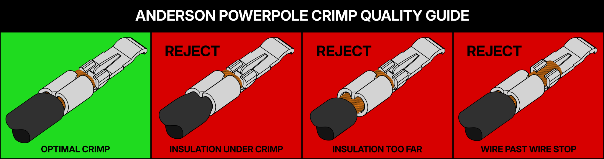
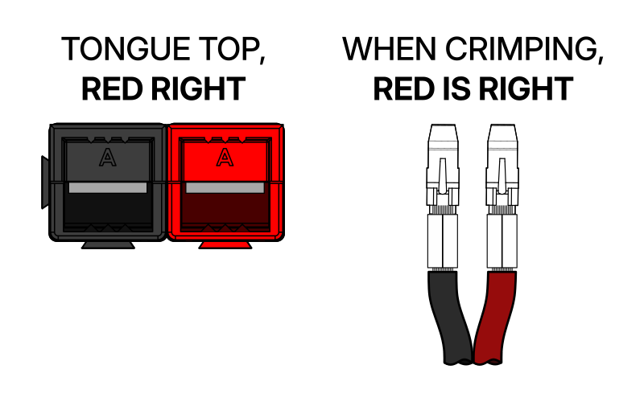

# Anderson Powerpole Connectors

**Overall requirement:** Show competency in making Anderson Powerpole (‘mini Anderson’) connectors.

A diagram of the powerpole crimp for open crimps. Source: [<u>FRCElectrical</u>](https://frcelectrical.org/Making-Connections/#anderson-powerpole)

**Explain and demonstrate the wire preparation required for powerpole connectors**

Wires should be stripped back so that the gap between the crimp and the insulation is minimal (\<2mm), when the wire is positioned correctly, as in the diagram. Correctly stripping the wire can prevent too large a gap, having wire past the stop, and reduces the chance for insulation under the crimp, so is essential in setting up a good crimp. Students should be able to do this without prompting or assistance.

**Demonstrate the process of crimping Anderson powerpole pins to prepared wires**

To crimp the connector, place the wire in the crimp. For open 45A crimps, pre-bending the ends of the crimp inwards can help to make the crimping easier. Insert into the crimping tool, with the end of the crimp fully inserted into the slot so it does not get bent by the crimping action. In the case of bonded/dual-core wire, orient the crimp so the shroud will match the orientation of the wires. The correct orientation is shown below.

Source: [<u>FRCElectrical</u>](https://frcelectrical.org/Making-Connections/#anderson-powerpole)

Once the orientation of the crimp is correct, squeeze the crimp tool fully closed. Students should be able to do this without prompting or assistance.

**Explain and attempt the process of inserting crimped wires into the Anderson powerpole shrouds**

To insert the crimped wire into the shroud, first make sure the orientations match. Either remember the diagram above, or you can remember that the ‘hook’ of the crimp needs to latch over the end of the metal tongue inside the shroud. Insert the wire, and push until you hear a ‘click’. It may be necessary to wiggle the wire a bit to get it into the shroud, and for 10AWG, the insulation may need to be thinned somewhat. This step is where having extra bare wire can be a significant problem, as it is much harder to push with, and other faults may affect how easily the crimp can fit into the shroud. Students should be able to demonstrate an attempt, but may ask for assistance with final alignment, or troubleshooting, as it can be very difficult
