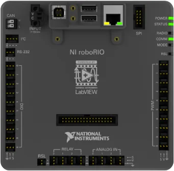
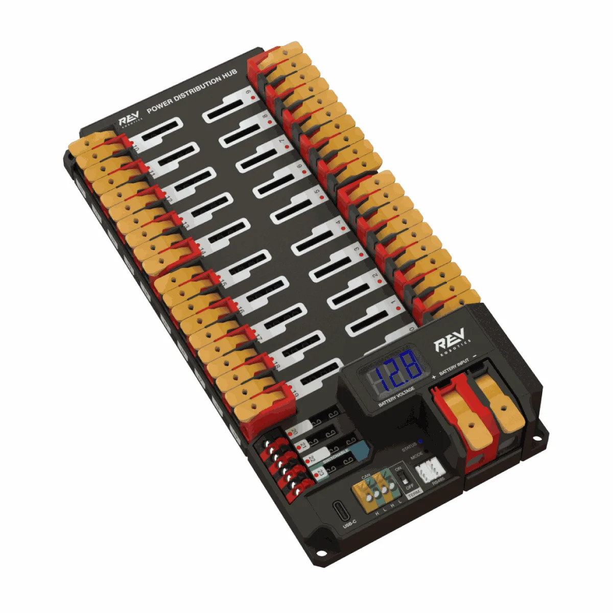
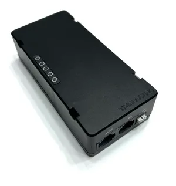
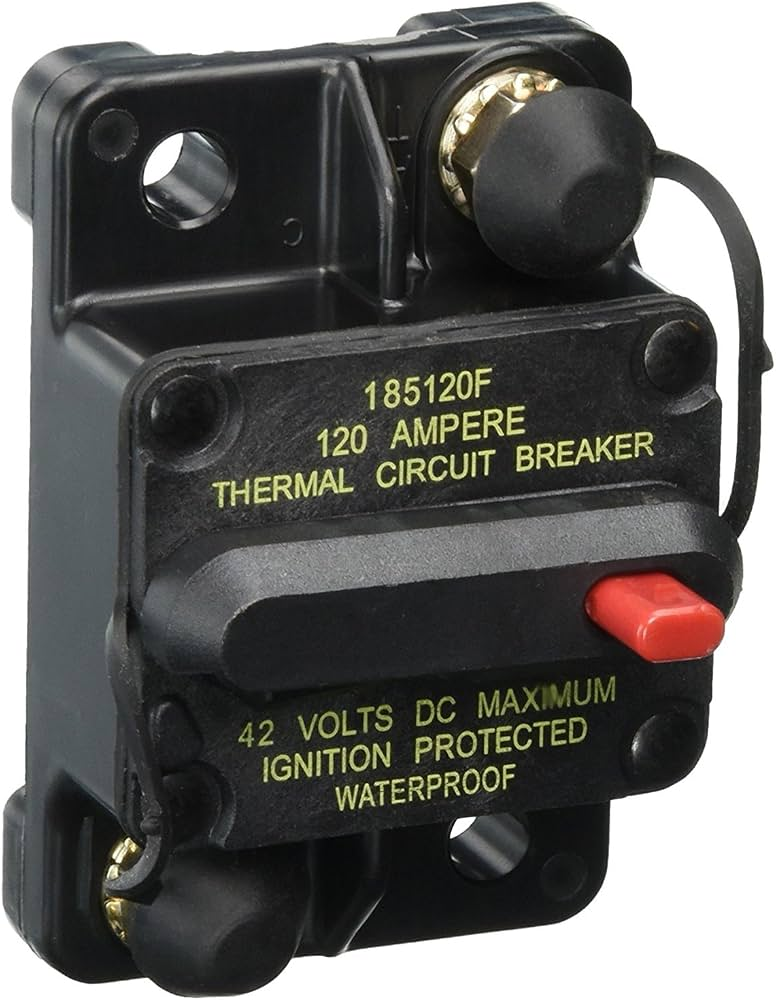
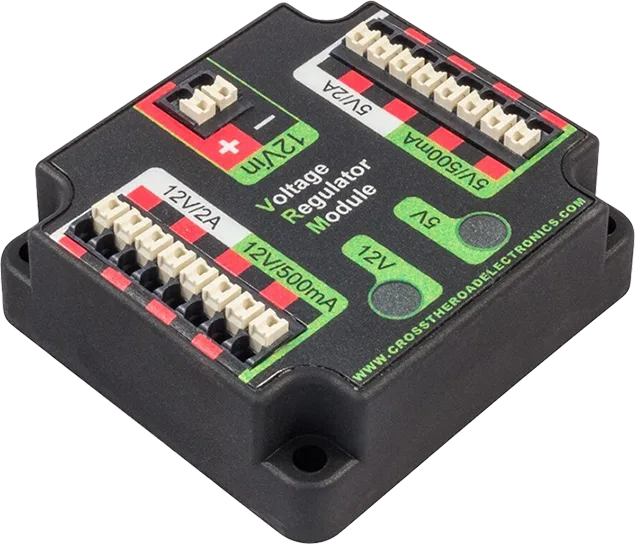
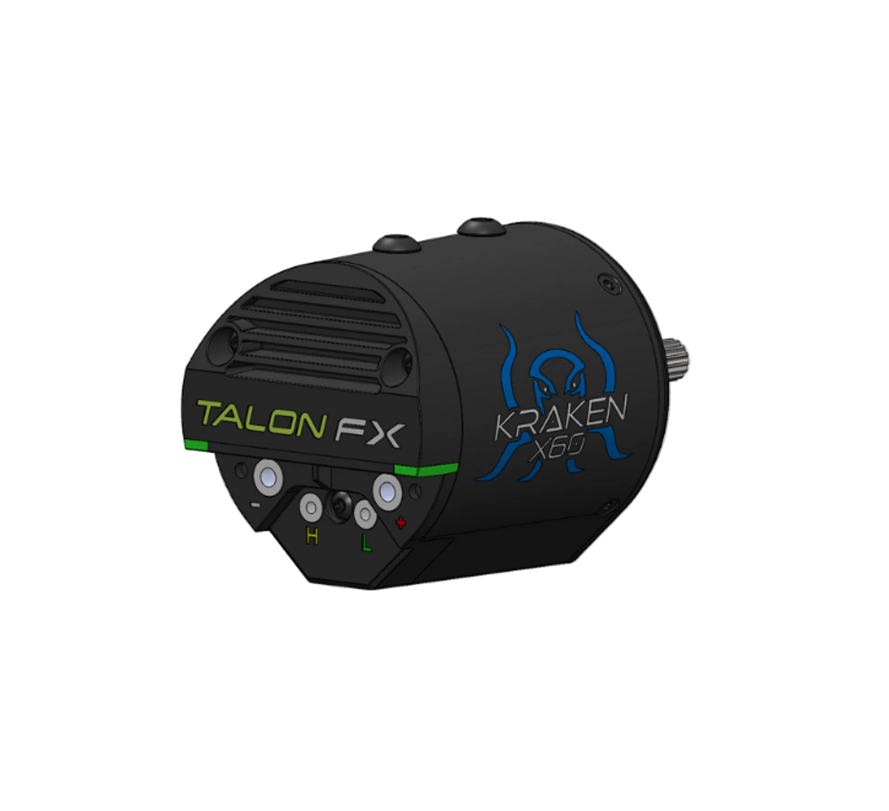
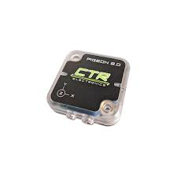
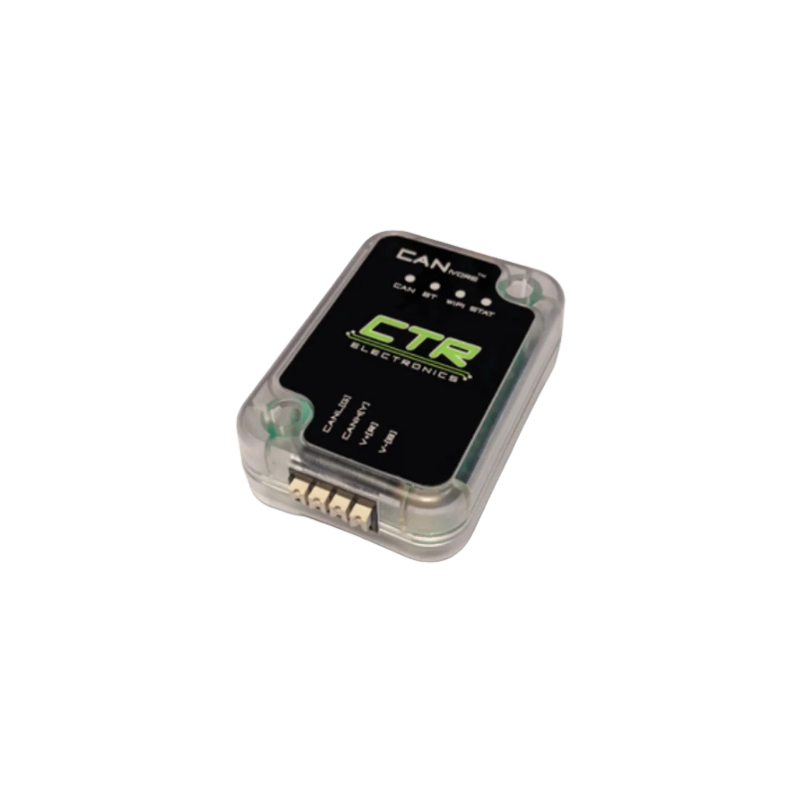
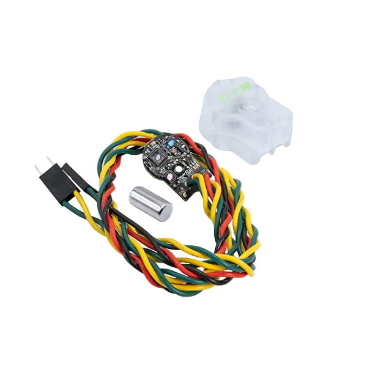

# Basic Electrical Knowledge

**Overall requirement:** Understanding of basic components and how they are connected. Should be completed by all students.

**Identify the common components of the electrical system:**

To pass this requirement, you must be able to point out ALL of the listed components on a chosen robot (lemon launcher for now). Almost all of the components are found in the bellypan, those located elsewhere will be indicated below. [<u>WPILib Docs</u>](https://docs.wpilib.org/en/stable/docs/controls-overviews/control-system-hardware.html) has some extra/different information about alternative components.

<figure markdown="span">
{ width="260" }
<figcaption markdown="span">[roboRIO](https://docs.wpilib.org/en/stable/docs/controls-overviews/control-system-hardware.html)</figcaption>
</figure>

<figure markdown="span">
{ width="349" }
<figcaption markdown="span">[PDH/PDP](https://docs.wpilib.org/en/stable/docs/controls-overviews/control-system-hardware.html)</figcaption>
</figure>

<figure markdown="span">
{ width="299" }
<figcaption markdown="span">[Radio (kicker side underneath turret)](https://docs.wpilib.org/en/stable/docs/controls-overviews/control-system-hardware.html)</figcaption>
</figure>

<figure markdown="span">
{ width="197" }
<figcaption markdown="span">[Main breaker (climber, next to battery)](https://www.amazon.ca/Bussmann-Hi-Amp-Reset-Circuit-Breaker/dp/B0024JMIRI)</figcaption>
</figure>

<figure markdown="span">
{ width="284" }
<figcaption markdown="span">[VRM](https://docs.wpilib.org/en/stable/docs/controls-overviews/control-system-hardware.html)</figcaption>
</figure>

<figure markdown="span">
{ width="311" }
<figcaption markdown="span">[Motor controller (specifically the back of the motor)](https://store.ctr-electronics.com/products/kraken-x60)</figcaption>
</figure>

OrangePi + transformer: unfortunately, I don't have a photo. The OrangePi is in a 3D-printed box, with a fan. The transformer is a little black box connecting the PDH to the OrangePi.

<figure markdown="span">
{ width="198" }
<figcaption markdown="span">[Pigeon (2.0)](https://store.ctr-electronics.com/products/pigeon-2)</figcaption>
</figure>

<figure markdown="span">
{ width="218" }
<figcaption markdown="span">[CANivore](https://store.ctr-electronics.com/products/canivore)</figcaption>
</figure>

<figure markdown="span">
{ width="212" }
<figcaption markdown="span">[RSL (Corner next to turret)](https://frcelectrical.org/FRC-Control-System)</figcaption>
</figure>

<figure markdown="span">
{ width="218" }
<figcaption markdown="span">[CANCoder (on top of each swerve module)](https://store.ctr-electronics.com/products/cancoder)</figcaption>
</figure>

**Explain the function of core components of the electrical system**

- roboRIO: The brain of the robot. It executes the robot software, receiving input from the Driver Station and cameras via the radio, and sends controls/ receives feedback from motors/sensors on the CAN bus.

- PDH/PDP: The PD stands for Power Distribution, and that's what it does, distributes power. It takes power from the battery and sends it to the controls (roboRIO, radio etc.) and motors. It has circuit breakers to limit current, and help stop things from exploding if something goes wrong.

- Radio: The remote connection point to the robot. It connects to the Driver station either wirelessly (at home/on field) or wired (in pits). It also connects the vision (OrangePi) to the roboRIO.

- Main breaker: The on/off switch for the robot. It sits between the battery and PDH to turn the robot on/off, and prevent serious damage if we draw WAY too much current.

- Motor controllers: Mini-computer that manages an individual motor. It controls how much power to give the motor, based on what the roboRIO has told the motor to do.

**Explain the need for different wire gauges for different purposes**

Wires have a (small) non-zero resistance. Power lost to resistance in wires causes heating of the wire, which is bad. Larger diameter wires have lower resistance, so they can carry higher amounts of current without excessive heating.

For this reason, we have several different sizes of wire on the robot, depending on what current we expect. The main power/battery cable is the largest (6AWG), followed by high-power motors (10AWG-12AWG). For small motors (JE) and other electronics (roboRIO, OrangePI etc.) we use 18AWG. For very small devices and signal wires (CAN bus) we use 22AWG.

If you want to see the maths behind it, the equation for heat losses is:

$P\  = \ VI\  = I^{2}R$

Where the resistance $R$ is given by

$R = \frac{\rho L}{A}$

$L,A$ are the length and area of the wire, $\rho$ is the resistivity of the metal. To double the current capacity of a wire, we need to quadruple the area, as the current is squared in the power loss equation.

**Demonstrate understanding of the process of battery management**

Battery management can be simplified down to two main things: keeping them on charge, and knowing when a battery is full. All batteries not in a robot should be on charge if possible. If the robot is delayed after a match, the battery should be taken back to the pits ASAP.

The lights on the charger have a lot of different modes, but there are three that indicate a battery is acceptable for use in a match. From best to acceptable, they are:

1.  One solid green light (100% charged, fully optimised)

2.  One green light, pulsing (100% charged, optimising/maintenance)

3.  All four lights, final green light pulsing (\>75% charged)

See the [<u>user guide</u>](https://no.co/media/wysiwyg/downloads/User_Guides/GEN/GEN_Series_NA_User_Guide_10.30.2024A.pdf) for more.

**Demonstrate battery and breaker use**

The process of power cycling the robot can be broken into four steps:

1.  Place the battery in its spot on the robot, in the correct orientation, and doing up the velcro strap

2.  Plug the battery into the robot, then turn the robot on by pushing the black lever on the breaker in, until it clicks, and the robot turns on.

3.  Press the red button on the main breaker, until a click is heard. Then unplug the battery.

4.  Remove the battery from the robot.
