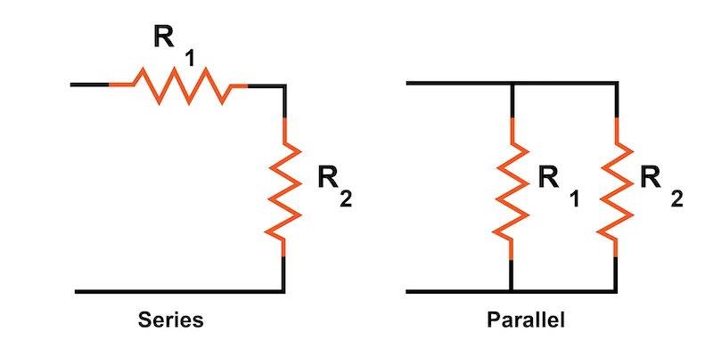

# Circuit Topologies

**Overall requirement:** Show understanding of basic circuit topologies and where they are found on the robot.

**Explain series and parallel wiring, and what each of these provide in terms of voltage and current**

Circuits with multiple devices can be wired either in series or in parallel. Each case has different characteristics regarding the voltage across each device, and the current running through them.

<figure markdown="span">
{ width="480" }
<figcaption markdown="span">[Series and Parallel circuits](https://www.allaboutcircuits.com/textbook/direct-current/chpt-5/what-are-series-and-parallel-circuits/)</figcaption>
</figure>

In a series circuit, since the same wire connects through all devices, the current through each device must be the same. As there is only one wire, a fault in one device means loss of power to all devices. The voltage is split across each device according to the resistance of each. More devices in series increases total resistance, so less current flows, decreasing total power.

In a parallel circuit, the voltage across each device must be the same, because there cannot be a voltage drop between the same side of two devices. Current is divided between each parallel branch, with more current flowing through a lower resistance path. Adding more devices in parallel reduces the resistance (more paths for current to take), so total current (and total power) increases.

**Identify where on the robot these topologies are used**

Because almost every device on the robot runs on 12V, series wiring for power is very rare as it requires splitting voltage over multiple devices. Parallel is actually very common: every device connected to the PDH is wired in parallel with each other. The more obvious example is CANCoder power, where all four CANCoders are powered off the same 12V power slot. The power is split into two, then four wires out to each device.

**Describe the topology of the CAN bus**

As a signal wiring system, the CAN bus is a little different. Each device is wired in series along each side of the CAN bus (yellow/green), but the devices do not cause a voltage drop by consuming power, they read the voltage difference between the two wires to read data, or change the voltage difference to send data out. At each end of the CAN bus, there is a 120Ω resistor between the two wires\*, which is often inside a specific device (roboRIO, PDH, CANivore).

!!! note
    \*Why this is done and how it works is the kind of thing you learn in third year uni, and not particularly important, so don’t worry about it.
