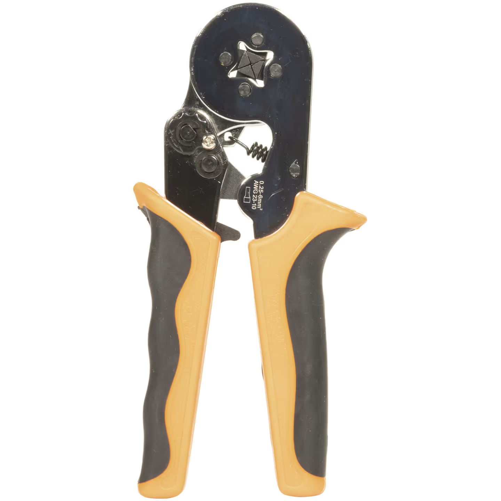
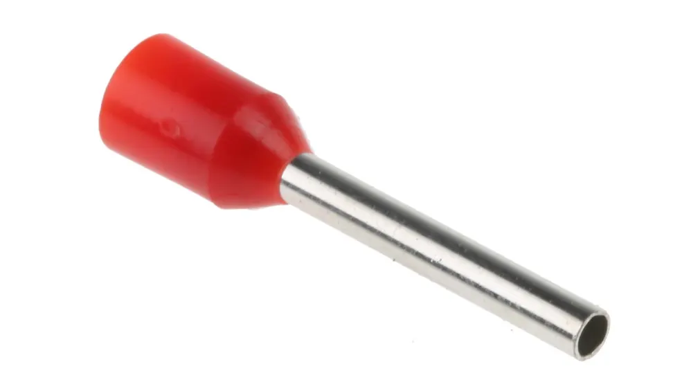

# Common Component Connectors

**Overall requirement:** Show understanding of wire preparation for different connectors, and competency in using the connectors commonly found on core electronic components.

**Explain and demonstrate the different wire preparation requirements for the different common component connectors**

Different connectors work better with different wire preparations. The two types of wire preparation are bare ends and ferrule-crimped ends. In general, ferruled ends are better for strong connections and hold up to cycling the connection (plugging/unplugging) better, as the wire cannot fray. For this reason, they are preferred for PDP (WAGO Cage Clamp), and Weidmuller (piano key) connectors where possible. 18AWG wire does not fit in Weidmuller ports with a ferrule, so an exception is made in this instance. WAGO 221/222 (what WAGO is used for colloquially) connections are best with bare, stripped wire, as that is what they are sized for, and the spring-clamp can handle strands shifting.

**Demonstrate ability to connect wires to PDH slots**

Since the PDH uses latching WAGO connectors (not technically 221s but close enough), bare wire ends are preferred, although square-crimped ferrules (the only kind we can make with our ferrule crimpers) are fine.

To connect wires to PDH slots, simply open the lever and insert the wire as far as possible. The end should be stripped such that the insulation ends inside the connector, but not too far inside. The connection should be electrically correct, and pass a tug test by the assessing mentor to verify connection strength. Students should be able to connect a motor to a specified slot without prompting.

**Demonstrate ability to crimp ferrules to stripped wires**

Students should be able to use the ferrule crimp tool to crimp a ferrule onto a 12AWG (motor power) wire and a 22AWG (CAN) wire, without prompting. Students may ask for confirmation on sizing for 22AWG ferrule.

<figure markdown="span">
{ width="299" }
<figcaption markdown="span">[Ferrule crimping tool](https://www.jaycar.com.au/4-point-hand-crimping-tool-for-bootlace-ferrules/p/TH1964)</figcaption>
</figure>

<figure markdown="span">
{ width="170" }
<figcaption markdown="span">[Ferrule](https://au.rs-online.com/web/p/bootlace-ferrules/2503438)</figcaption>
</figure>

**Demonstrate ability to connect wires to PDP slots (WAGO Cage Clamp)**

PDP slots are WAGO Cage Clamp, so wires should have ferrules attached. To open the connection, a flathead screwdriver is used to lever the clamp, and the wire is then inserted into the slot. Students should be successful in attaching a motor to a specified slot without prompting.

**Demonstrate ability to connect wires to VRM slots (Weidmuller)**

VRM slots take different wire sizes, either 18AWG or 22AWG. Students should be able to connect a pair of either of these wire sizes to a VRM with the correct end preparation (18AWG bare, 22AWG ferruled), without prompting.
