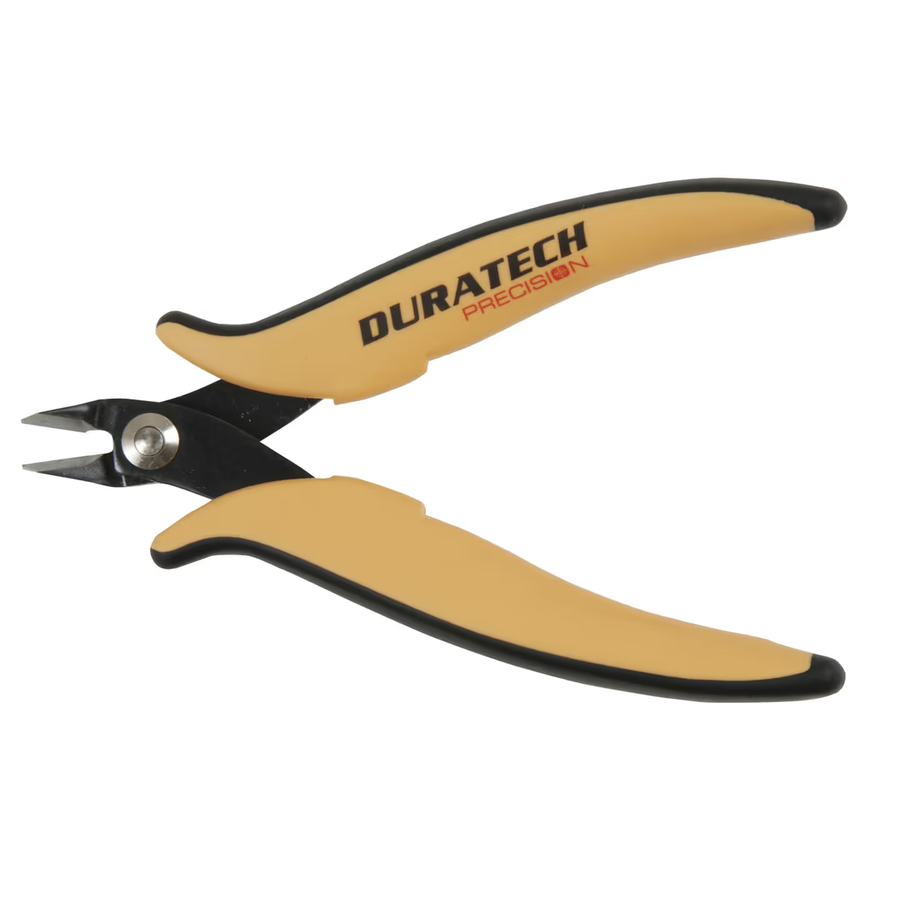
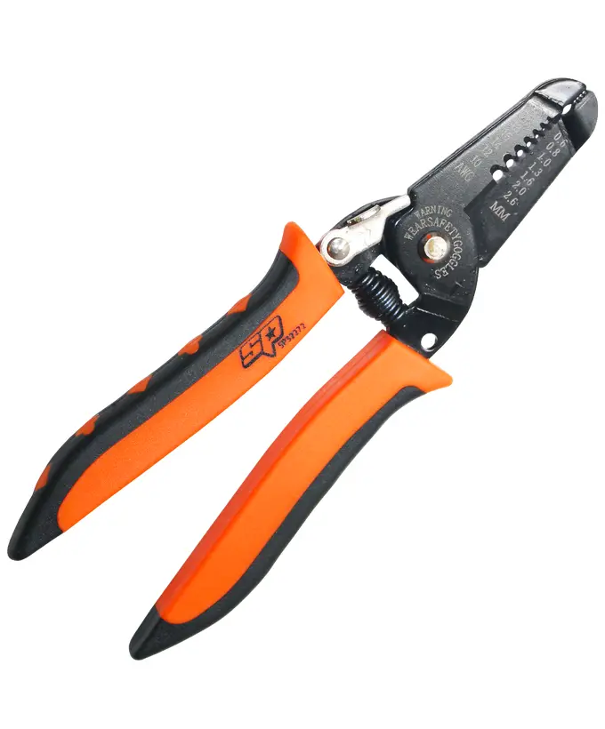
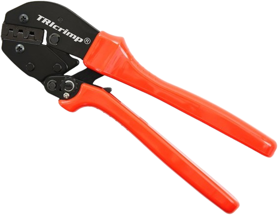

# Basic Electrical Knowledge II

**Overall requirement:** Greater understanding of basic components and how they are connected, and some basic practical skills. Should be completed by all electrical students.

**Identify the different wire colours and their meanings**

Different colours of wire insulation are used as a label for what role they are serving. The main colours to be aware of are:

- Red: power wire (positive)

- Black: power wire (negative)

- Yellow: CAN bus (high)

- Green: CAN bus (low)

These colours are consistent almost everywhere they appear on the robot, with a couple of exceptions. Limit switch cables have four wires in parallel: red, white, blue and black, which are all used for signals (whether each switch is closed). Also, some smaller power wires are dual-core, they have both the red and black wire contained within a sheath, which can be grey or white. The red and black internal cores can be seen at each end, where the sheath is cut to allow the ends to connect.

**Explain the function of extended core components of the electrical system:**

- VRM: The voltage regulator module is responsible for powering small electronics (CANCoders, pigeon,CANivore etc.). It provides more stable voltage than the battery, with very low current limits, which is good for small components. It also has 5V slots, which we no longer use, along with its 12V slots.

- OrangePi + transformer: The OrangePi runs PhotonVision, taking camera frames and extracting April Tag data, which it sends to the roboRIO via the radio. The OrangePi requires 5V at higher current than the VRM can provide, so it has a separate 12V-5V converter (not really a transformer, but close enough) as a power supply.

- Pigeon (2.0): A nine-axis inertial measurement unit. Sounds scary, but it is just a sensor that tells us the robot’s orientation in 3D. It is crucial to the robot knowing what direction it is facing, which is part of knowing where it is.

- CANivore: A second CAN bus that connects to the roboRIO over USB. We use it for the drivebase, to keep it separate from the other motors in case something goes wrong with a mechanism, so we can still drive and play defence. The CANivore uses a more modern, faster version of CAN, so it can handle more devices and do faster feedback loops, but only supports CTRE devices.

- CANCoder: An absolute encoder (has a magnet with a persistent position, rather than starting at zero when turned on). We use them in the swerve modules to know the exact orientation of the wheels. Without a CANCoder, we would have to ensure all of the wheels were pointed in the right direction before turning the robot on.

**Demonstrate the use of a multimeter for measuring voltage, resistance and continuity**

To measure voltage, students should be able to use the multimeter to measure the voltage of a battery, using the probes to contact across the battery plug terminals. For resistance, students should be able to measure a 120$\Omega$ resistor, and demonstrate checking the robot frame isolation, by checking the resistance between each of the main power terminals, and various points on the robot frame. To test continuity, students will be given a length of bonded wire, and told to check each core.

::: danger
When using the multimeter it is important to **NEVER measure current!!** If anything is done incorrectly it can very easily damage the (very expensive) multimeter.
:::

**Identify common tools used in electrical work and their purpose**

<figure>

<figcaption><a href="https://www.jaycar.com.au/precision-127mm-angled-side-cutters/p/TH1897">Flush/side cutters</a>: cutting wire, stripping very large (battery) wire.</figcaption>
</figure>
<figure>

<figcaption><a href="https://autozoneaustralia.com.au/product/wire-cutter-strippers/">Wire strippers</a>: strips insulation from wires for soldering/connectors. Different parts of the cutter correspond to different wire sizes.</figcaption>
</figure>
<figure>

<figcaption><a href="https://powerwerx.com/powerpolebag-tricrimp-powerpole-case-gear-bag">Anderson Powerpole crimp tool</a>: Crimps Anderson connectors onto stripped wire.</figcaption>
</figure>

Most other electrical tools are crimp tools for other connector types, which will be covered as they arise.

**Demonstrate ability to strip wires of various sizes**

Students should be able to use wire strippers to strip a short length of CAN bus wire, and 12AWG power wire, using the correct sizing for minimal loss of wire strands.

**Explain and demonstrate the process of preparing and using WAGO 221/222 connectors**

WAGO connectors are the simplest way of connecting two wires together. Each slot on a WAGO holds one stripped wire, and all of the slots are connected.The 221 connectors are the clear version with the large lever, while the 222 are the smaller, grey ones. To demonstrate, students should be able to connect two power wires using a 221, and two CAN wires using a 222.
