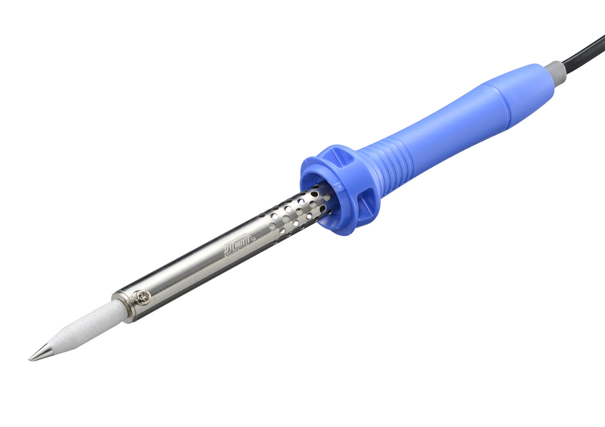
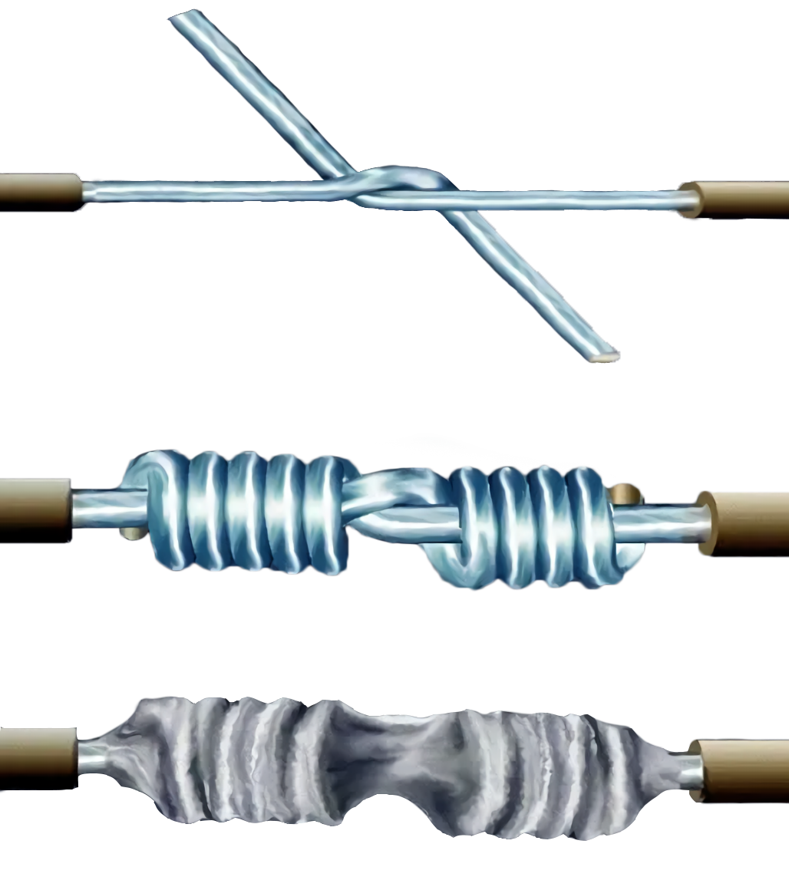

# Basic Soldering

**Overall Requirement:** Demonstrate understanding of how to safely solder wires together.

## Understand the hazards associated with use of a soldering iron (and heat gun)

::: danger
## ALWAYS assume the iron is hot!!!
:::

Soldering irons get very hot, and therefore pose a burn hazard if handled incorrectly. In the included image, everything past the blue handle in the above image is too hot to touch when the iron is on.

<figure>

<figcaption><a href="https://en.goot.jp/products/detail/kx-100r">Soldering iron</a> (excluding base station)</figcaption>
</figure>

To reduce the risk of accident, whenever you are not using the iron, it MUST be stored in the holster attached to the base of the soldering iron. When soldering large wires, the wire can heat to the point of being too hot to hold. If the wire begins to become hot as you hold it, stop and wait for the wire to cool before continuing.

Similar to the soldering iron, the heat gun presents hazards both in the ‘hot end’, and heating of the work piece. Unlike the iron, it does not have a cover/holster for the hot end, so it must instead be placed such that the chance of accidental contact is minimised.

<figure>

<figcaption><a href="https://www.totaltools.com.au/137178-makita-2000w-50-650-c-variable-heat-gun-kit-hg6530vkit">Heat gun</a></figcaption>
</figure>

Separate to the safety concerns of the soldering iron, the heat can also damage plastic components, so be careful when soldering wires near 3D prints.

## Explain, either verbally or through dry-run demonstration, proper soldering technique

The process of soldering wires together can be summarised in the following steps:

1.  Turn on the iron. For small wires, ~350°C is appropriate. Always check, as it may have been used for heat-set brass inserts for 3D prints, which require a much lower temperature.

2.  Strip each of the wires. The amount required increases with wire size. In general, soldering is easier with a bit more wire stripped back. For CAN/18AWG, ~10mm, is about right.

3.  Place heat shrink onto one of the wires

4.  Twist the ends together (inline). The included image is pretty good depiction.

    1.  Form an X, with the crossover close to the insulation end of the stripped lengths.

    2.  Twist the stripped ends around the base of the other wire

    3.  Tighten the twist by tugging the wires apart gently

5.  Clean the iron on the sponge, and then tin the iron, by melting a small amount of solder onto it. This helps with the contact area to transfer heat into the wire.

6.  Apply the iron and the solder from opposite sides of the wire (typically above and below). This ensures that the wire heats enough that solder flows through the joint, rather than a thin coating.

7.  Apply solder until it has joined the two wires, but without excess solder causing the joint to bulge.

8.  Wait for the joint to cool, then slide the heat shrink over the joint, and shrink it with the barrel of the iron, or the heat gun.

<figure>

<figcaption>Wire-wire soldering. Source: <a href="https://frcelectrical.org/Making-Connections/">FRCElectrical</a></figcaption>
</figure>

## Demonstrate ability to strip, twist, solder, and heat-shrink a CAN bus wire

Execute the process described above, using CAN bus wire or similar small wire, following all safety rules, without prompting.

## Demonstrate ability to prepare multi-core wire for soldering

Multi-core 18AWG wire (grey sheath), has a few more steps to preparing the ends for connectors/soldering. The outer sheath, and the filler material must be removed a few cm back from the end of the wire, without damaging the insulation of either core. Then, the wire must be stripped. As the soldering process is much the same as for CAN wire, a demonstration is not required
