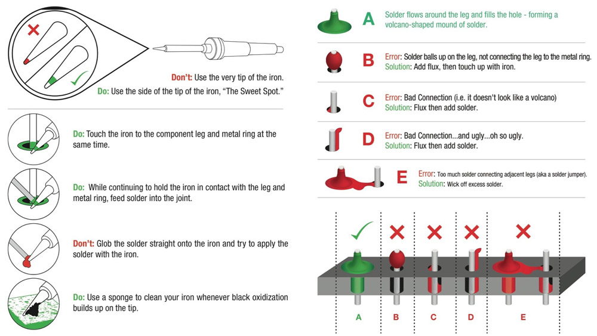

# Component Soldering

**Overall requirement:** Show understanding of the challenges of soldering to printed circuit boards (PCBs), and perform demonstrations for solder pads and through-hole connections.

## Demonstrate understanding of the additional challenges soldering to PCBs

PCBs tend to have small solder connections, meaning working with small wires in a way that requires greater precision than wire-wire joints. PCB solder joints come in two main types: surface mounts (solder pads), which are a small metal plate, and through-hole connections, a small hole in the board. The joints can be more difficult to hold securely while working on them than wire-wire connections, and because there are often many PCB connections close to each other, stray solder can cause shorts between connections, which can damage components if powered on.

## Explain, either verbally or through dry-run demonstration, proper technique for soldering wires to solder pads.

1.  Strip the wire. The amount should correspond to the length of the solder pad.

2.  Tin the surface pad by melting a small amount of solder onto it, just enough to leave a small blob.

3.  Tin the wire by melting a small amount of solder onto the bare end.

4.  Join the wire to the pad by holding them together, and applying the iron to re-melt the solder on each part of the connection.

5.  Remove the iron, while holding the connection together for 2-3 seconds as the solder cools and solidifies.

## Demonstrate ability to solder a wire to a solder pad

Execute the process described in the above image, following all safety rules and without prompting.

## Explain, either verbally or through dry-run demonstration, proper technique for soldering wires to through-holes

For through-hole soldering, the element being attached to the PCB can be either a wire or a component, e.g. a resistor. In the case of a wire, the wire must be stripped, ideally as little as possible while having ~1-2mm of bare wire exposed on the bottom of the PCB. Once the wire is prepared, follow the instructions in the image below.

<figure>

<figcaption>Image from <a href="https://learn.sparkfun.com/tutorials/how-to-solder-through-hole-soldering">SparkFun</a></figcaption>
</figure>

## Demonstrate ability to solder a wire to a through-hole connection

Execute the process described in the above image, following all safety rules and without prompting.
