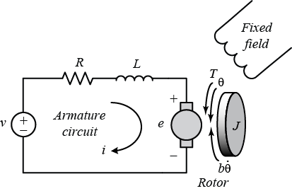
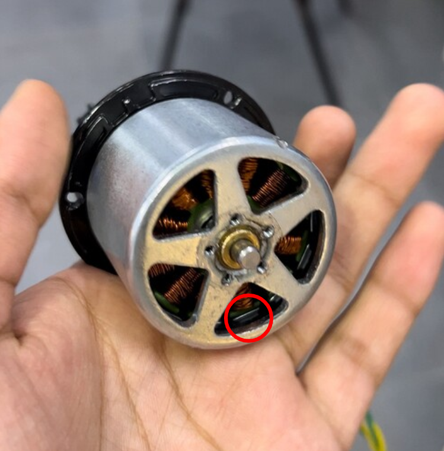

# Understanding DC Motors

Motors are the way we make the robot do anything, meaning that understanding how to integrate them into mechanisms is crucial to robot design. Motor choice, gearing, packaging, and motor sensors are all required for a viable mechanism, which must then be leveraged in software to produce performance. Given their importance to design, and their prominence in the robots software, it might seem odd to group all of the required knowledge about motors under electrical, but it is through understanding the electrical principles behind DC motor operation that good design and control is possible. Therefore, it is recommended that all students familiarise themselves with this document, as it is relevant to almost every component of the robot.

This document provides the necessary theoretical background to explain each of the key principles regarding design and control of DC motors. It is recognised that many students do not require all of this detail, so the key conclusions will be **emphasised in bold**.

## Operating Principle

DC motors work by passing current through coils of wire in the presence of a magnet (either permanent or an electromagnet). The interaction of the moving charge and magnetic field produce a Lorentz force causing the motor shaft to rotate. The particular physical design depends on whether the motor is brushed or brushless.

## Modeling DC Motors

The circuit model for a DC motor is fairly simple, consisting of four components, as seen in the diagram. V represents the voltage applied to the motor at the output of the motor controller. R and L are the resistance and inductance of the motor coils. E is the voltage drop ‘across the motor’, the voltage that is actually contributing to the rotational motion of the output.

<figure>

<figcaption>Electrical diagram of a DC motor. <a href="https://ctms.engin.umich.edu/CTMS/index.php?example=MotorSpeed&section=SystemModeling">Source</a></figcaption>
</figure>

For a given motor voltage, E, and current, I, the motor operates at a known speed $\omega$, and provides a known torque, $\tau$. **The relationships between these are given by the equations:**

$$E = k_{m}\omega$$

$$\tau = k_{t}I$$

Since energy must be conserved, $P_{out} = P_{in}$, so

$$EI = \tau\omega,\ k_{m}\omega I = k_{t}I\omega \Rightarrow k_{t} = k_{m}$$

At steady-state, inductors are short circuits, so assuming the motor is operating at constant speed and torque, L can be ignored. This means the current (and torque) in the motor is given by

$$I = \frac{V}{R} = \frac{V - E}{R},\ \tau = k_{t}I = k_{t}\frac{V - E}{R}$$

## Supply and Stator Current

On the real robot, there are actually two different current values that we must concern ourselves with. The first is the supply current, on the PDH side of the motor controller. **Supply current is provided at battery voltage** (~12V). Limiting supply current caps the amount of power that can be provided to the motor, which is **necessary to prevent brown-out and excessive battery drain.** If the supply limit is extremely prohibitive, it can also potentially limit motor acceleration. **The stator current is provided at motor voltage (V).** Limiting stator current caps the amount of acceleration that can be achieved by the motor, and is **necessary to prevent damage to the motor (magic smoke)/mechanism (mechanical failure)**.

Assuming the motor controller uses no power for itself, then $P_{in} = P_{out}$ for the motor controller, allowing us to determine the relationship between supply and stator current.

$$12V \times I_{sup} = V_{out} \times I_{stat}$$

**Since $V_{out} \leq 12V$, $I_{stat} \geq I_{sup}$.** The highest limit circuit breaker allowed for FRC motors is 40A, however, as they are thermal breakers, they do not trigger immediately if the motor draws more than 40A, typically able to handle up to double their limit for a couple of seconds. However, since averaging over ~60A continuous over the course of a match is a bad idea for battery life ([source](https://www.mkbattery.com/application/files/6817/5105/7491/ES17-12.pdf)), constraining supply currents to the breaker limits (or even lower) is helpful to minimise the chance of browning out by endgame. The motors (Kraken X60) themselves can safely take 80A continuous stator for (slightly) longer than an entire match ([source](https://motors.reduxrobotics.com/)), so that is generally considered an appropriate limit.

As high current can damage the robot in various ways, it is important to consider the choice of current limits and the impact they can have on mechanical performance. As current is proportional to the required torque, **high current can often be avoided through proper gearing and motor selection.**

## Gear Ratio Selection

Selecting the best gear ratio for a mechanism is key to extracting performance from the robot. **Too little gearing (classic mechanical team) in an attempt to achieve high speed means higher torque requirements on the motor, leading to high current draw**. High current then means either **current limiting which reduces overall mechanism speed, or excessive power usage** and potential to trip breakers/damage motors. Under-gearing can be identified by **high current and low motor speed** during testing. Excessive gearing also limits mechanism speed, when the motor’s maximum speed is too slow. Because the motor **torque requirements are low, current draw is low**, so unless very strict current limits are used, the **motor can damage the mechanism if something goes wrong**. Over-gearing can be identified by the **motor output reaching 1.0 (full output)** or rpm approaching free speed.

An example of under-gearing can be seen on this year's intake pivot, where the motor at cruise speed is ⅛ of free speed, with peak current draw at 40A during retraction. Increasing the gearing by another 4:1 stage would give (roughly) ½ free speed and peak current of 10A for the same mechanism speed. Obviously there are packaging constraints that can limit the ability to achieve larger ratios, as is the case with this mechanism.

An example of over-gearing was the arm on the 2023 robot. Extension at max motor speed was only drawing 10A, and was slow enough to limit reaching fixed positions. Swapping the VersaPlanetary from 20:1 to 15:1 and eventually 12:1 was able to improve overall manipulator speed, at the cost of increased current draw by the arm motor.

A major part of selecting gear ratios is **being realistic about goals for mechanism speed**. It is all well and good to say that Locked In’s elevator can be run at 6:1 for a 0.5s full extension time, but it completely neglects the 80A required to accelerate and achieve that speed, let alone the software control to make that speed safe. This is different from the previous examples, as **even though it was a theoretically possible configuration, given our abilities, it was not feasible to execute**, requiring an increase to 15:1 for actual use.

## Brushed and Brushless Motors

There are two main types of DC motor, being brushed and brushless. In FRC, the brushed DC motor has fallen out of fashion as of late, due to lower efficiency, power-to-weight ratios and no real cost benefit due to how expensive all the motor controllers are. Brushed motors also have less long-term reliability, but these lifetimes are not ever really reached in FRC.

### Brushed Motors

Brushed motors are mechanically simpler than brushless motors, so it is helpful to start there. They are also electrically simpler, and do not require a motor controller, being able to be attached directly to a battery (though rarely a good idea). A brushed motor has a magnetic stator encompassing a rotating armature (coil). Current in the coil produces a magnetic field which repels against the stator, causing rotation. The brushes allow the direction of current to swap in the coil, so the magnetic field in the coil is always opposing the stator.

### Brushless Motors

Brushless motors are more complex, requiring a motor controller, as the switching of current is managed electronically, rather than mechanically with brushes. Brushless motors are commonly designed with the coils being static, in the middle of the motor, while the magnets spin around them (Falcons are like this, as seen in the image). The controller puts a voltage across each coil in order to create a rotating magnetic field which causes the magnetic rotor to spin.

<figure>

<figcaption>A Falcon 500 with outer case removed. The coils remain stationary in the center, while the magnets (circled) are attached to the outer drum, which rotates. The output shaft (removed here) is attached to the rotor using the five mounting holes. (<a href="https://www.chiefdelphi.com/t/falcon-500-fully-disassemble-cinderella-1942/446923">Source</a>)</figcaption>
</figure>
