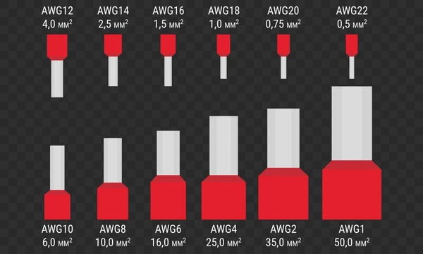

# Wire Gauge Guide

This document is intended to record guidelines and checklists that we come up with for doing robot wiring.

## Wire Gauges

The minimum wire gauges for different parts of the robot are specified in the game manual.

| Application | Gauge |
|:------------|:------|
| Battery to PDP | 6 AWG (7 SWG or 16 mm²) |
| Size 31 – 40A breaker protected circuit | 12 AWG (13 SWG or 4 mm²) |
| 21 – 30A breaker protected circuit | 14 AWG (16 SWG or 2.5 mm²) |
| 6 – 20A breaker protected circuit 11-15A fuse protected circuit Minimum Wire Size Between the PDP dedicated terminals and the VRM/RPM or PCM/PH Compressor outputs from the PCM/PH | 18 AWG (19 SWG or 1 mm²) |
| Between the PDP/PDH and the roboRIO Between the PDH and VRM/RPM ≤5A breaker protected circuit ≤10A fuse protected circuit | 22 AWG (22 SWG or 0.5 mm²) |
| VRM 2A circuits | 24 AWG (24 SWG or .25 mm²) |
| roboRIO PWM port outputs | 26 AWG (27 SWG or 0.14 mm²) |
| SIGNAL LEVEL circuits (i.e. circuits which draw ≤1A continuous and have a source incapable of delivering >1A, including but not limited to roboRIO non-PWM outputs, CAN signals, PCM/PH Solenoid outputs, VRM 500mA outputs, RPM outputs, and Arduino outputs) | 28 AWG (29 SWG or .08 mm²) |

## Wire Gauges We Use

| Part | Gauge |
|:-----|:------|
| Talon SRX Falcon 500 Power | 12AWG |
| Talon SRX CAN Falcon 500 CAN (probably) | 22AWG |

## CAN Bus Wire

Sizes of some different options for CAN bus wire

| Wire Source | Approx Diameter | Approximate AWG |
|:------------|:----------------|:----------------|
| Old CAN Bus (that we have been using for years) | 0.45mm | 25 |
| KOP Sample CAN Wire | 0.77mm | 21 |
| New CAN wire (Nick bought, sold as 22AWG) | 0.55mm | 23 - 24 |
| Random (not tinned copper) | 0.72mm | 21 |

## AWG Wire Sizes

These sizes are a summary of values from [Wikipedia](https://en.wikipedia.org/wiki/American_wire_gauge). American Wire Gauge: decrease by 3 => double area.

| Gauge | Diameter (mm) | Area (mm²) |
|:------|:--------------|:-----------|
| 10 | 2.588 | 5.26 |
| 11 | 2.305 | 4.17 |
| 12 | 2.053 | 3.31 |
| 13 | 1.828 | 2.62 |
| 14 | 1.628 | 2.08 |
| 15 | 1.45 | 1.65 |
| 16 | 1.291 | 1.31 |
| 17 | 1.15 | 1.04 |
| 18 | 1.024 | 0.823 |
| 19 | 0.912 | 0.653 |
| 20 | 0.812 | 0.518 |
| 21 | 0.723 | 0.41 |
| 22 | 0.644 | 0.326 |
| 23 | 0.573 | 0.258 |
| 24 | 0.511 | 0.205 |
| 25 | 0.455 | 0.162 |
| 26 | 0.405 | 0.129 |

<figure>

<figcaption>Ferrule sizes for each AWG, showing how cross-sectional area grows as gauge decreases.</figcaption>
</figure>

<https://www.youtube.com/watch?v=_EixzYfBS50>
