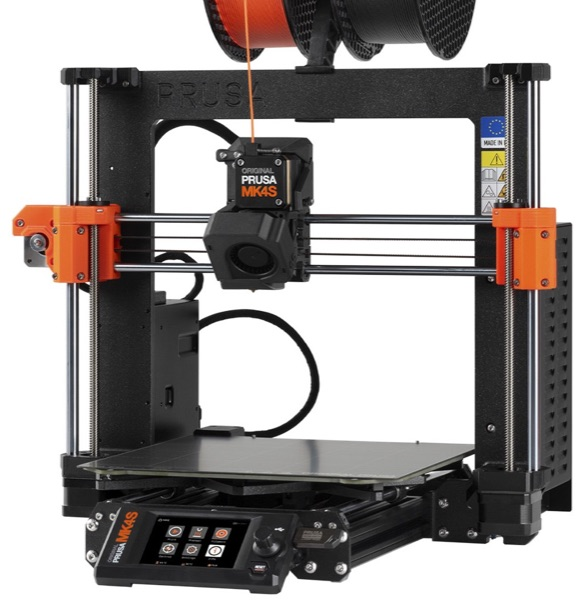
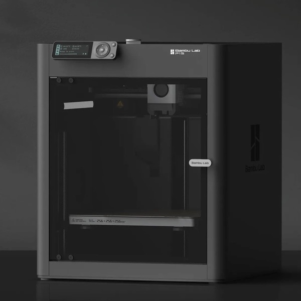

# 3D Printing

How we design parts for 3D printing: our printers, settings, filament and the hardware that goes with printed parts.

For how to export, slice and print a part, see the [3D Printing & Slicing Guide](./3d-printing-slicing).

## Printers

| Printer | Bed size | Notes |
|---------|----------|-------|
| Prusa MK3S+ | 250 × 210mm | |
| Prusa MK4S | 250 × 210mm | Faster than the MK3S+ |
| Bambu P1S | 256 × 256mm | Faster than the MK3S+. Multi-material printing. Has an enclosure (for special filaments) |

<figure>

<figcaption>Prusa MK4S (image: Prusa Research)</figcaption>
</figure>
<figure>

<figcaption>Bambu P1S (image: Bambu Lab)</figcaption>
</figure>

## Design Rules

- **Standard Print Settings** - Use 2 perimeters and 20% infill for non-structural parts. We use gyroid infill by default.
- **Keep Prints Away from Impacts** - Avoid 3D printed parts anywhere they could be hit.

### Orientation and Strength

- **Layers Shouldn't Take the Load** - Parts are weakest between layers. Orient the part so the main load runs along the layers, not across them. 
- **Put a Flat Face on the Bed** - Design at least one large flat face to print on, so the part doesn't need supports.

### Holes and Fits

- **Holes Print Undersize** - You may need to print a test to determine the appropraite size for the hole. Alternatively consider drilling the hole to size after printed (need to consider an appropriate number of perimeters)
- **Inserts for Reusable Threads** - Use threaded inserts (see [Hardware for Printed Parts](#hardware-for-printed-parts)) or captive nuts wherever possible (rather than plastic threads)
    - Use nyloc nuts with caution– they will quickly round out the print if not assembled with caution.

### Walls and Strength

- **Minimum Wall Thickness** - About 1.2mm (3 perimeters at a 0.4mm nozzle). Thin features snap.
- **Perimeters, Not Infill** - Extra walls around bolt holes and bearing bores add far more strength than more infill.
- **Radius Inside Corners** - Sharp internal corners crack under load.

### Printability

- **Fit the Bed** - Keep parts within the bed size (see [Printers](#printers)). Otherwise split the part and design a way to join it e.g. bolts
- **Split Complex Parts** - Break complex parts into simpler printable pieces rather than supporting everything.
- **Consider Print Time** - A 12 hour part is hard to remake at competition. If it could break, make it quick to reprint.

## What We Print

- **Pulleys**
- **Belts** - For prototyping only, in TPU 98A.
- **Spacers**
- **Tube plug sleeves**
- **Spur gears** - Low duty only, and with caution. e.g. 2026 Turret
- **Cases for electronics** - e.g. cameras.
- **Wheels**
- **Cable clips**
- **Mounting brackets**

## Filament

| Filament | Strength / application | Buy from |
|----------|------------------------|----------|
| PLA | Stiff and easy to print, but brittle and softens with heat. Prototypes and low load parts | eSun or BambuLab |
| PETG | Tougher and less brittle than PLA. General robot parts, e.g. spacers, brackets and cases | eSun or BambuLab |
| TPU 95A | Flexible and rubbery. Compliant parts, bumpers and grippy surfaces, e.g. roller and wheel treads | eSun |
| TPU 98A | Stiffer than 95A but still flexible. Prototype belts | Ethan* |

## Hardware for Printed Parts

| Hardware | Application | Buy from |
|----------|-------------|----------|
| 10-32 expanding / heat-set inserts | Threaded holes for bolting printed parts to the robot structure, e.g. mounting brackets | Thrifty or WCP |
| M3 bolts and heat-set inserts | Small, light parts, e.g. electronics cases | AliExpress |
