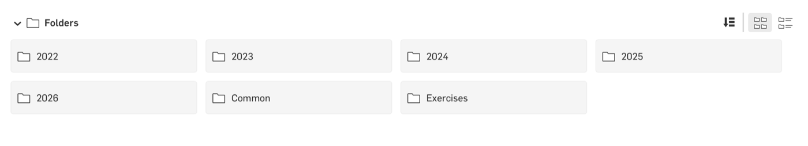
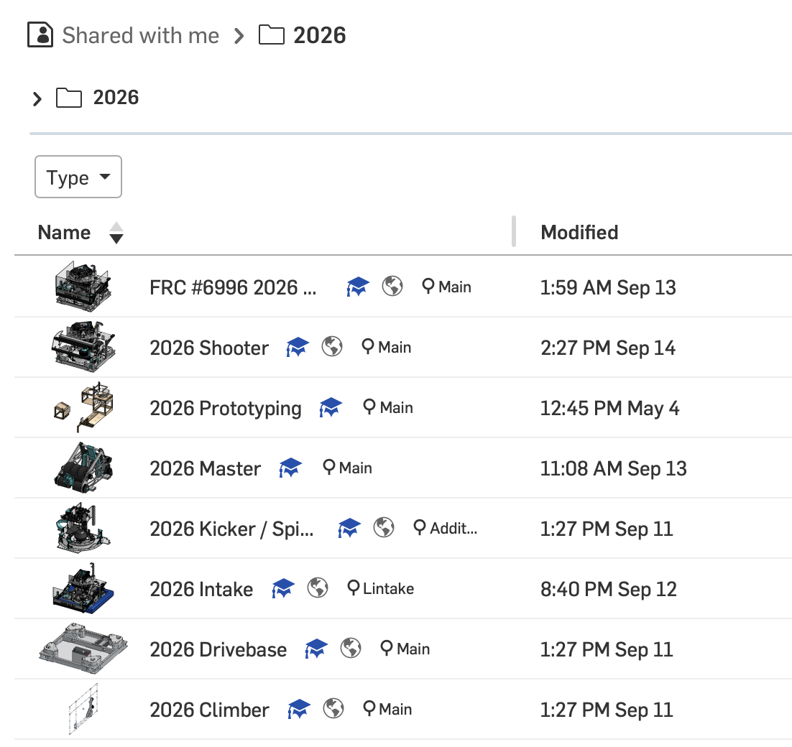

# CAD Standards

These are the conventions we follow in Onshape so that anyone on the team can open a document and understand it. 

They are not final, and the points are open for discussion.

## Folder Structure

The structure of the Onshape folders we store our CAD documents in should be as follows.

- One folder per season, named after the 4 digit year, e.g. `2026`
- A `Common` folder for documents containing reusable parts
- An `Exercises` folder for training exercises

<figure>

<figcaption>Our team folders in Onshape</figcaption>
</figure>

## Document Structure

We structure our robots in multiple documents, allocating each subsystem a single document. 
We can have a robot design either in a single document, or use multiple documents.

Each season's folder (see [Folder Structure](#folder-structure)) contains:
- One top-level robot document containing a master-part studio and a final assembly, named `[year] Master`, e.g. `2026 Master`
- One document per major mechanism, named `[year] [mechanism]`, e.g. `2026 Intake`
- A prototyping document, named `[year] Prototyping`
- The public copy of the robot, named `FRC #6996 [year] ...` (see the note on making documents public below)

A second robot gets its own folder within the season folder, with the same structure.

Parts from other documents can only be inserted from a version, so create a version when a mechanism is ready to be pulled in, and update references in the top level document when it changes. 

Each mechanism document should contain
- Part studios for each subsytem
- Assemblies for each subsystem
- An overall assembly for the mechanism
- A test assembly (an assembly which pulls other mechanisms in to test for interferences- without needing to update the version every time)

<figure>

<figcaption>The 2026 folder: the public copy, the master document, a prototyping document and one document per mechanism</figcaption>
</figure>

Before making a document public, consider making a copy so the edit history isn't shared (e.g. when publishing robot CAD each year)

## Units
- Design the overall robot in inches. Each document for a major subassembly should be set up in inches.
- Type the units you mean. For example, if you want a 2mm gap in a inches document, type ‘2mm’ for the dimension. It will be stored and display 2mm when you edit it, even though the sketch displays inches.

## Naming
- Give all tabs and parts meaningful names, e.g. 'Intake Side plate', not 'Part 12'
- Give all features, planes and sketches meaningful names, e.g. 'Bearing holes', not 'Extrude 7'

## Part Studios
- Use folders in Part Studios to group together the sketches and features that make a specific part. This isn't always possible, but do it where you can.
- Order features so the design builds up logically, and roll back to insert new features in the right place rather than adding everything at the end.

## Materials, Mass and Appearance
- Assign a material to every part, e.g. Aluminium 6061 or Polycarbonate. Onshape uses it to calculate mass, so the robot's weight and centre of gravity are only right if every part has one.
- You can use the mass override for 3D printed parts, as infill means the material mass will be wrong. One option is using the mass estimate from the slicer.
- COTS parts from FRCdesignlib all come with a mass.
- Set appearances to match the real part, e.g. grey for aluminium, clear for polycarbonate, and the filament colour for printed parts.

## Assemblies
- Group all static parts from the part-studio in an assembly with a single group mate before adding any COTS parts. 
- Use sub-assemblies. This makes mating parts much easier and is essential when the sub-assembly is used repeatedly.
- Define mate points in the part studio to make constructing assemblies easier.
- Use the ability to mate parts to a sketch to simplify assemblies where appropriate. For example spacing parts along a shaft, as in the 2022 robot indexer.
- Use the FRC design app or pre-existing team CAD files wherever possible/practical

## Versions and Branches
- Create a version at each milestone (design review, sent to manufacture, competition)
  with a descriptive name, e.g. `Intake v2 - sent to CNC`.
- Use branches to try out design variations. Merge the branch you keep, and
  delete or clearly label the rest.

Do not make copies of documents in team folders just to muck around with. To experiment with design use branches, or make copies to one of your own private folders.
