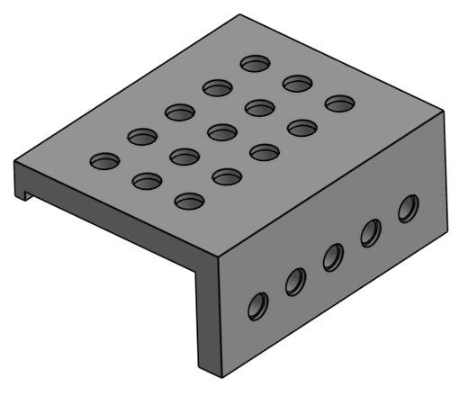
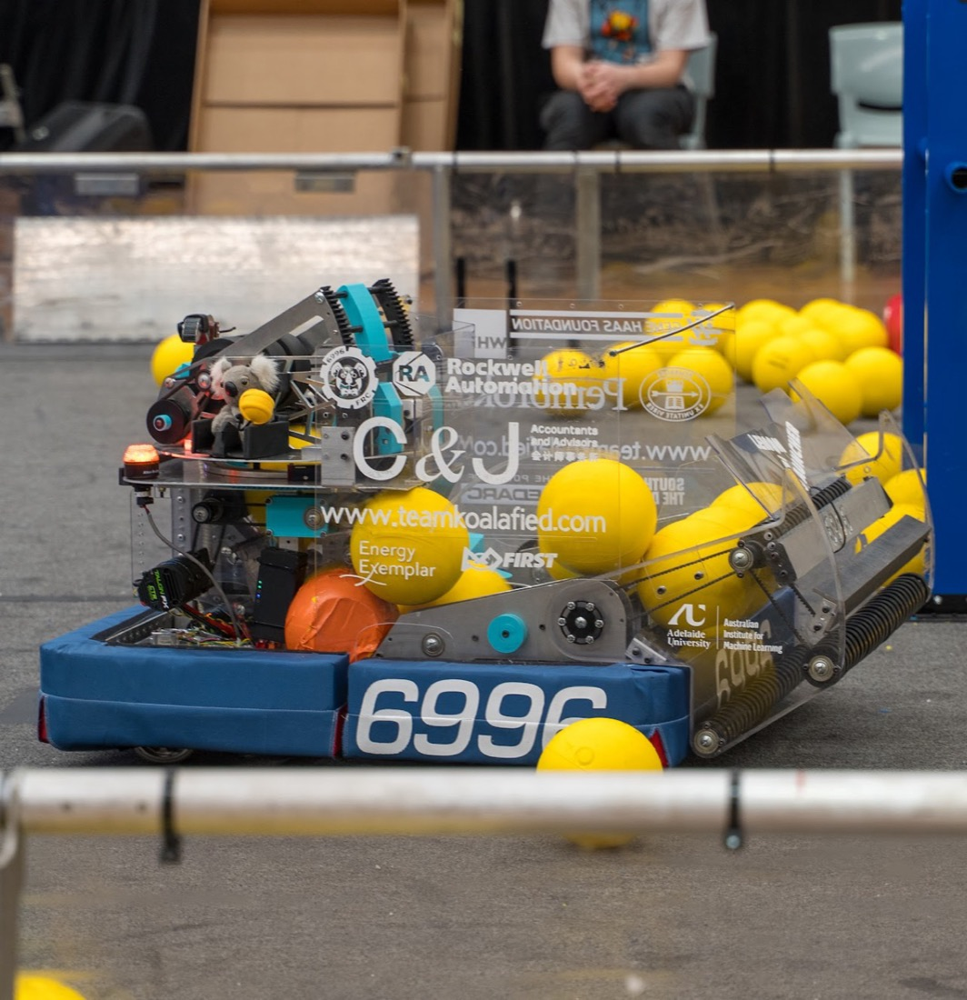
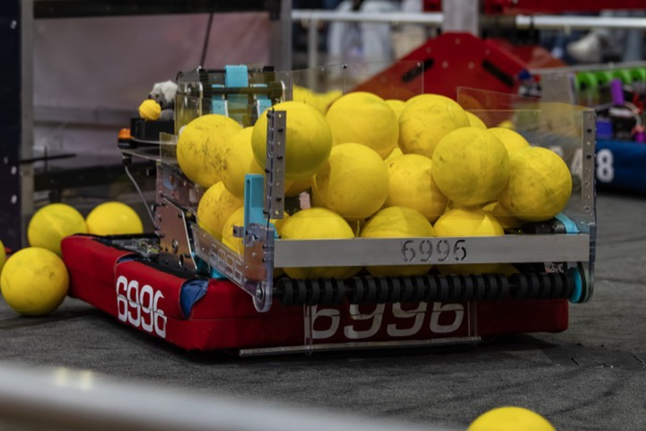

# Design Rules

These are the rules of design we try to live by. No rule applies 100% of the time, but if you are not following one you need to think about it and have a good reason.

For the motors, gearboxes, materials and other parts we use, see [Parts & Materials](./parts-and-materials).

## Design Goals

Every rule on this page comes back to three goals. When they conflict, they win in this order.

- **1. Reliable** - The robot has to work every match. A simple mechanism that works every time will score more than a clever one that works half the time. 
- **2. Competitive** - Our robot is designed to play the game well and hopefully win matches!
- **3. Repairable** - Things will break. We need to be able to fix them quickly between matches.

## Design Process

- **Block Model First** - Do this before detailed work on any sub-system. Block models are important for allocating space and rough weights to each mechanism. They also validate the geometry of moving subsytems (e.g. an intake retracting)
- **Place the Battery Early** - It is heavy, has a fixed size, affects the centre of gravity and needs to be easy to swap.

## Prototyping

- **Prototype from MDF** - It is cheap and quick to cut. Only use the real material if one of its properties (e.g. stiffness, weight or friction) matters to what you are testing. MDF is never on the final robot. 
- **Prototype What Touches the Game Piece** - e.g. intakes, indexers and shooters. The game piece changes every year, so these are hard to get right in CAD alone. Mechanisms that don't touch the game piece, like elevators, can usually go straight to CAD.

## Robot Layout

- **Drivebase Reliability Comes First** - If the robot can't drive, nothing else on it matters.
- **Minimum Degrees of Freedom** - Every extra degree of freedom adds weight, motors, sensors, code and another thing that can fail.
- **Low Centre of Gravity** - Pay attention to placement of motors and the battery. A low centre of gravity stops the robot tipping when it accelerates, turns or gets hit.
- **Stay Inside the Frame Perimeter** - Anything outside the frame perimeter will get hit, so it must be robust.
- **Small Robots Are Good** - They are lighter, accelerate faster, and fit through gaps in defence. They are also much easier to transport (particularly for champs!)
- **Flipped Drivebase with Brainpan** - Putting the electronics in a brainpan allows enough space for good quality wiring, and ensures overall robot reliability. See [Belly/Brainpan Layout](../electrical/belly-brainpan-layout).
- **Avoid Pneumatics** - Pneumatics add a lot of system weight for tanks, regulators etc. Consider other ways of getting linear motion with motors, e.g. rack and pinion or a winch.

## Structure

- **No T Gussets** - Normally gussets should ‘fill in the triangle’, because that is much stronger.
- **Tube Wall Thickness** - Generally use thick wall tube for the drivebase and thin wall for most of the superstructure.
- **Plate Thickness** - Prefer 2.5mm aluminium plate where possible. It is lighter, quicker to machine and easier to work with. Use 5mm plate when you plan to pocket it.
- **Polycarbonate for Impacts** - It bends rather than cracks, so use it for guards, covers and other parts that get hit.
- **Extrusion Holes on a 0.5in Grid** - Put holes for mounting to extrusion on a 0.5in × 0.5in grid. We have a jig for drilling these.

<figure>

<figcaption>Our tube drilling jig, for holes on the 0.5in grid</figcaption>
</figure>

## 3D Printing

See [3D Printing](./3d-printing) for our printers, print settings and rules for printed parts.

## Mechanisms

- **Build in Compliance** - Mechanisms exposed to collisions should give way rather than break. For example, when an intake collides with something it should retract.
- **Hard Stops** - Stop mechanisms from moving past their range wherever possible. This protects the mechanism and especially delicate things like wiring and limit switches. They are mandatory on any mechanism with a limit switch, otherwise the mechanism can overrun and damage the switch.
- **Limit Switches** - Avoid placing limit switches on the outside of the robot. Use thick wires, latched [spade connectors](../electrical/spade-connectors) and strain relief.
- **Retain Bearings Outside the Robot** - e.g. on intakes. These bearings need their own retention, separate from the shaft retention. See [Shaft Retention](./parts-and-materials#shaft-retention).
- **Plan the Wiring** - For mechanisms that move, e.g. an intake folding out, leave a path for the wires that won't pinch or stretch them through the full range of motion.

### Intakes

- **Intakes are Hard** - Intakes have to deal with a different game piece each year, so it is harder to reuse previous designs, and each year they need tuning. Intakes also need to be the most reliable part of the robot after the drivebase.
- **Make the Driver's Job Easy** - The driver should be able to pick up a game piece quickly, from as many positions and angles as possible, without having to stop and line up exactly.
- **Rolly-Grabber Intakes** - Prefer intakes that run continuously, like rollers, over claws that open and close. A continuous intake grabs the game piece whenever it touches it, so it doesn't rely on the driver's timing.
- **Large Acquisition Zone** - The wider the area the intake can grab a game piece from, the less precisely the driver has to line up.
- **Touch It, Own It** - Run the intake roller surface faster than the drivetrain's top speed, so the intake grabs the game piece as soon as it touches it.
- **Bash Bars on Intakes** - They stop intake shafts from bending when they hit things.

::: details Case study: 2026 intakes
Both our 2026 intakes were full width (large acquisition zone) rolly-grabbers.

- **SCR** - A slap down intake with no bash bar, and no compliance. It bent several shafts, which was a whole ordeal to fix.
- **MRT** - We swapped to a linear intake with a bash bar, which could retract when hit. It was much better.

<figure>

<figcaption>SCR: slap down intake</figcaption>
</figure>
<figure>

<figcaption>MRT: linear intake</figcaption>
</figure>

:::

### Climbers

- **Ratchet or Brake** - The climber must stay engaged when the robot is disabled at the end of the match. The robot must not fall down, or rely on the motors to hold it up.

## Power Transmission

- **Belts First** - Use them over chain and gears where possible. Pulleys should generally be 18T or larger.
- **Steel Gears for High Loads** - Aluminium gears wear and strip on high load mechanisms, e.g. pivots and arms.
- **Chain Size** - Use #25 chain for low load mechanisms and #35 for high load. Often it is worth discussing with a mentor or doing a calculation to determine what is most appropriate. 
- **Tension Chains** - Use turnbuckles wherever possible. This only works for non-continuous motion, e.g. an elevator. For continuous motion consider using cams, or swapping to an appropriately tensioned belt.

## Serviceability

- **Build Mechanisms as Sub-Assemblies** - Each mechanism should be built off the robot, then mounted as one complete unit. This lets people build in parallel, and means a broken mechanism can be removed and fixed on the bench, or swapped for a spare.
- **Bolts, Not Rivets, on Removable Parts** - Rivets are fine for structure that stays together, but anything that needs to come off the robot should unbolt.
- **Minimise Hex Key Sizes** - Use as few fastener sizes as possible, so the pit crew only needs one or two hex keys (typically 1/8" and 5/32") to work on the robot.
- **Repeat Parts** - Wherever possible, e.g. make both sides of an intake identical. It means fewer designs to make, less CAM work, and spares that fit in more than one place.

## Design Numbers

| What | Rule |
|------|------|
| 10-32 clearance holes | 5mm (or #11 drill)|
| 10-32 tap holes | 4.1mm (#20 drill) |
| 5mm rivet holes | 5mm |
| 1.125in bearing holes | 1.130 in CAD, or 1.125 then step-drill |
| Internal corner radii (CNC) | Greater than 2mm (4mm end-mill) |
| CNC sheet size | 550 × 1150mm maximum |

## Resources

- **Design calculators** - [ReCalc](https://www.reca.lc), [AMBCalc](https://ambcalc.com)
- **Mechanism examples** - [Project B](https://www.projectb.net.au/resources/robot-mechanisms/), [FRCDesign.org](https://frcdesign.org/mechanism-examples/)

## Crazy Team Specific

- **Tom Knows a Guy** - If you need something, just remember, Tom knows a guy who can help!
- **Ask Roman** - If you are stuck on a problem after already building a mechanism, ask Roman. He has magic fixes.
