# Fusion 360 CAM Guide

Prerequisites:

- A Fusion 360 account
- Fusion 360 installed on the computer
- STEP file downloaded from Onshape

Notes about this guide:

- The feeds and speeds used here are designed for aluminium sheet/plate. They will also generally be suitable for polycarbonate.
- Please give it a go first, then consult a mechanical mentor for advice / final review once attempted.

::: warning When to consult mentors
- Milling **aluminium tubes** is complicated. Lower the stepdown substantially. Ensure appropriate clamping. Talk to mentors.
- Mistakes are made with **3mm PC** and **>9mm PC / MDF** all the time.
  - These are generally due to inappropriate use of clamps / insufficient use of screws.
:::

## Quick Reference

All the numbers used in this guide, for a 4mm end mill in aluminium.

| Operation | Setting | Value |
|-----------|---------|-------|
| Setup | Spoilboard size (max stock) | 1150 × 550mm |
| Setup | Stock top offset | 0mm |
| Tool (4mm flat end mill) | Feed rate | 1000 mm/min |
| Tool (4mm flat end mill) | Spindle speed | 24000 rpm |
| All operations | Bottom height offset | -0.5mm |
| Bore | Pitch | 0.8mm |
| 2D Contour | Tab width / height | 4mm / 1.5mm |
| 2D Contour | Maximum roughing stepdown | 1.6mm |
| Adaptive Clearance | Radial / axial stock to leave | 0mm |
| Adaptive Clearance | Ramping angle | 4° |
| Adaptive Clearance | Ramp clearance height | 1mm |

## Setup

1. Import .STEP file into Fusion 360

   After clicking *open*, a dialog box will open. Click *open from computer* and find the downloaded .STEP file within file explorer.

   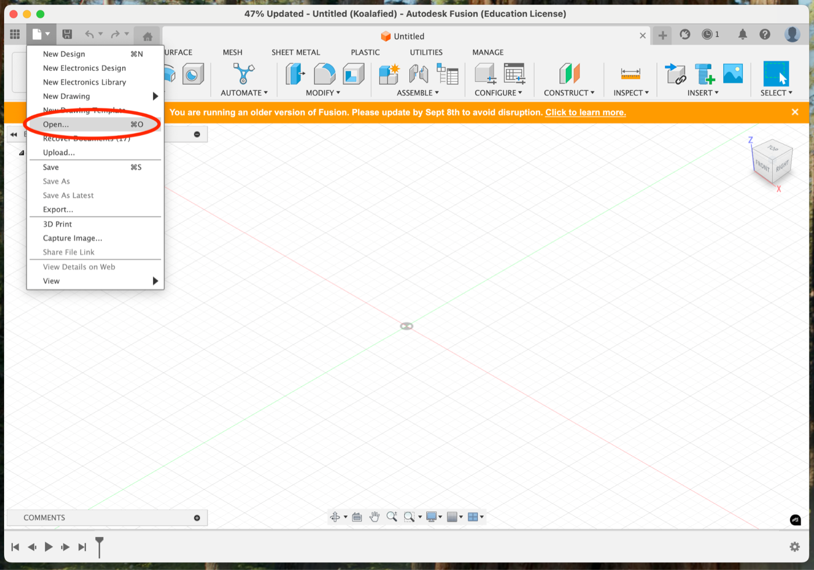

2. Switch to 'Manufacture' tab

   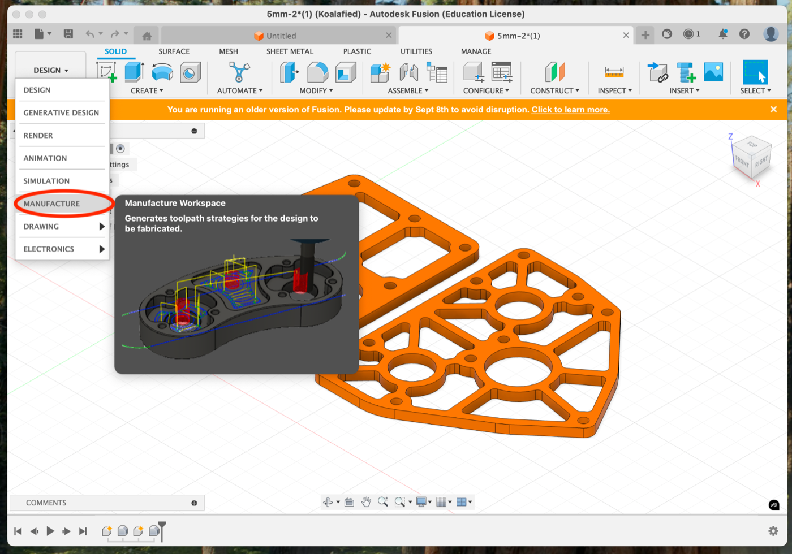

3. Create the 'setup'

   1. Click the setup button (1)
   2. Ensure that 'box point' is currently selected. It should be highlighted blue. (2)
   3. Select a box point on the top of the part in a corner. (3)

   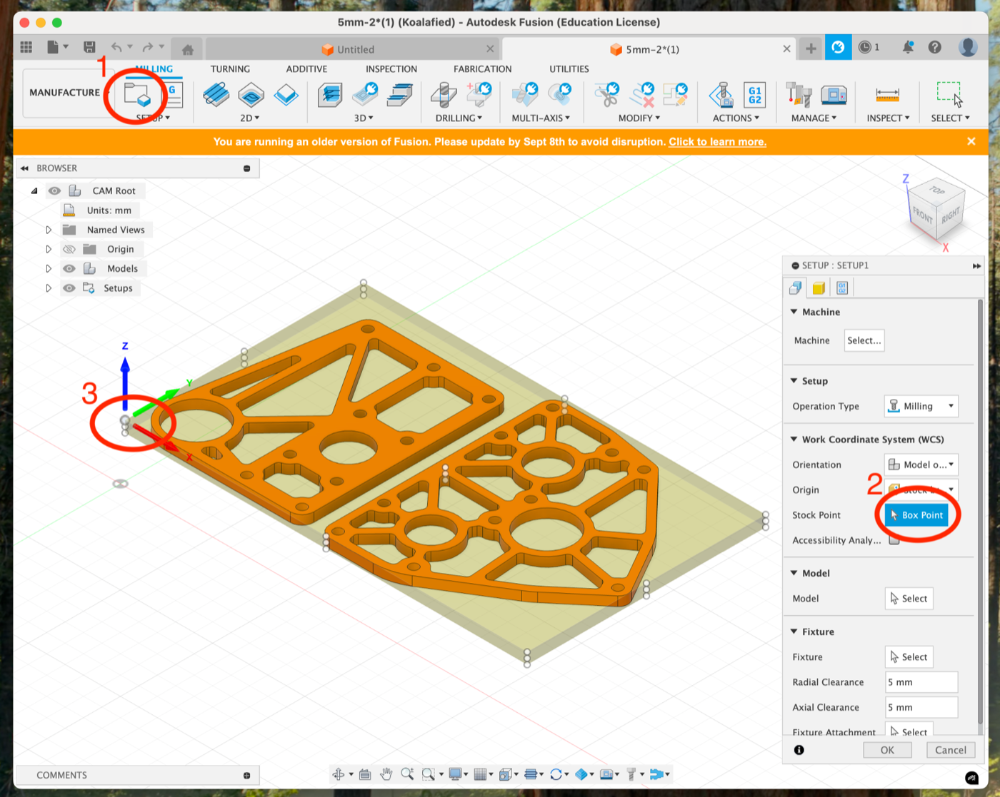

4. Realigning the axes. (Not always necessary)

   The *x axis* (red) represents the short axis of the CNC router. The *y axis* (green) is the long axis. The *Z* axis must always point up.

5. Stock box offsets

   In the *stock* tab (1), ensure the *stock top offset* is **0 mm** (2).

   It is also useful to check the stock dimensions against the material you intend to use to cut the part.

   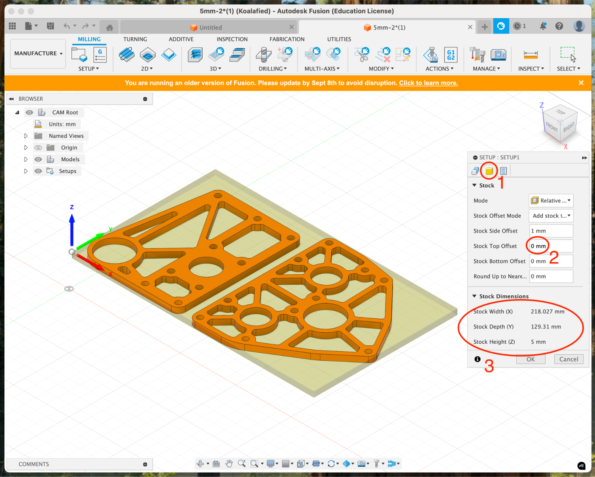

6. Finalise the setup

   Click *ok* at the bottom of the *Setup* window. If cutting multiple parts, a warning will pop up. Click *yes* to ignore the warning.

   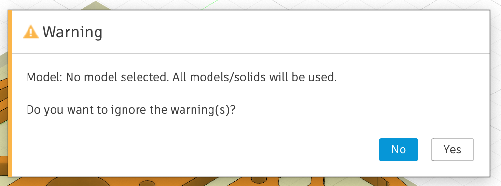

7. Create a tool

   In the 'manage' section of the tool bar, open the *tool library.*

   In the *local library*, create a new tool with the ***+*** icon in the top toolbar.

   Select *flat end mill* as the tool type.

   Other than *tool diameter*, *feed rate*, and *spindle speed* all values in the tool setup can usually remain as default.

   | End Mill        | Feed Rate     | Spindle Speed |
   |-----------------|---------------|---------------|
   | 4mm (Aluminium) | 1000 mm / min | 24000 rpm     |

   Seek mentor guidance if using a tool other than a 4mm end mill.

## Bore (Holes)

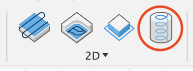

To create holes, the *Bore* function is used. This is good for creating holes larger than the tool diameter (e.g. drilling a 5mm hole with a 4mm mill bit)

1. Select holes.

   The entire hole should be highlighted, not just the top circumference. This can be sped up by selecting holes of the same diameter, or by using a diameter range.

2. In the *heights* tab, ensure the bottom height offset is ***-0.5mm***

   This ensures that the mill bit cuts all the way through the bottom of the material.

3. In the *passes* tab, **untick** *Use Ramp Angle* (1) and set *Pitch* to **0.8 mm** (2)

   Pitch is the amount of depth the mill bit travels in one rotation of the bore.

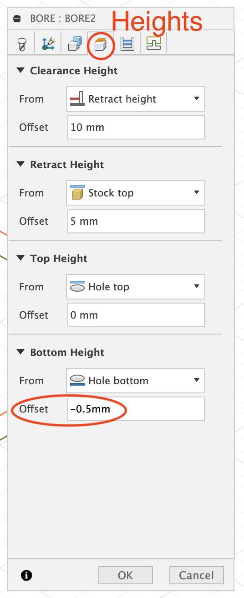 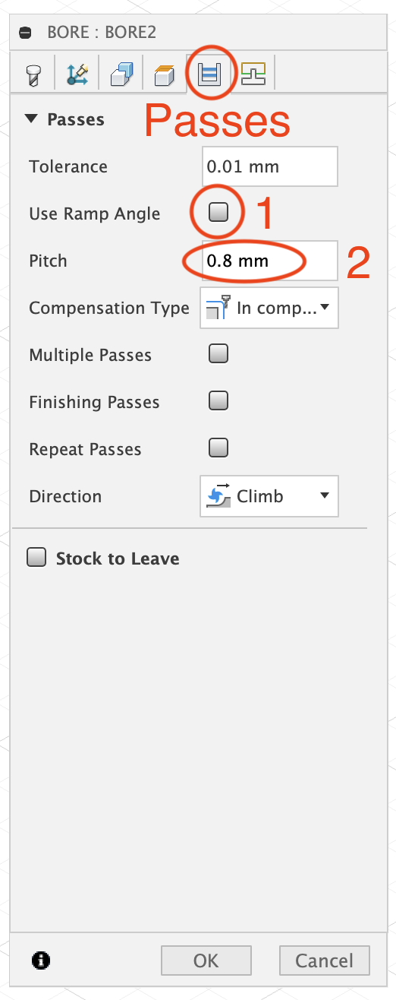

## 2D Contour

1. Select contours

   When selecting a contour you must ensure the **bottom** edge of the part is highlighted.

2. Tabs

   **Tick** the *Tabs* box (1). Ensure that the *Tab Width* and *Tab Height* are **4mm** and **1.5mm** respectively (2).

   There is no set *Tab Distance* (3) or number of tabs which should be on each part. A couple of guiding rules are:

   1. **Minimum** 4 tabs per part (for small parts – many more tabs for large parts).
   2. Each straight line on the part should have 1 or 2 tabs (possibly more on larger parts).
   3. Avoid tabs on curved sections (they are harder to remove).

   Tabs can be automatically created by setting a *Tab Distance* (3), and trying a few different distances until one appears suitable. Alternatively, they can be manually added by selecting *Manual Tabs* (4), and clicking on the part.

   If you do not want any automatic tabs, set *Tab Distance (3)* to 0mm.

   ::: danger
   Tabs stop the part from moving while it is being cut. They are critical to not breaking the CNC machine, the mill bit, and the part. **If unsure about tabs, seek help from an experienced student or mentor.**
   :::

   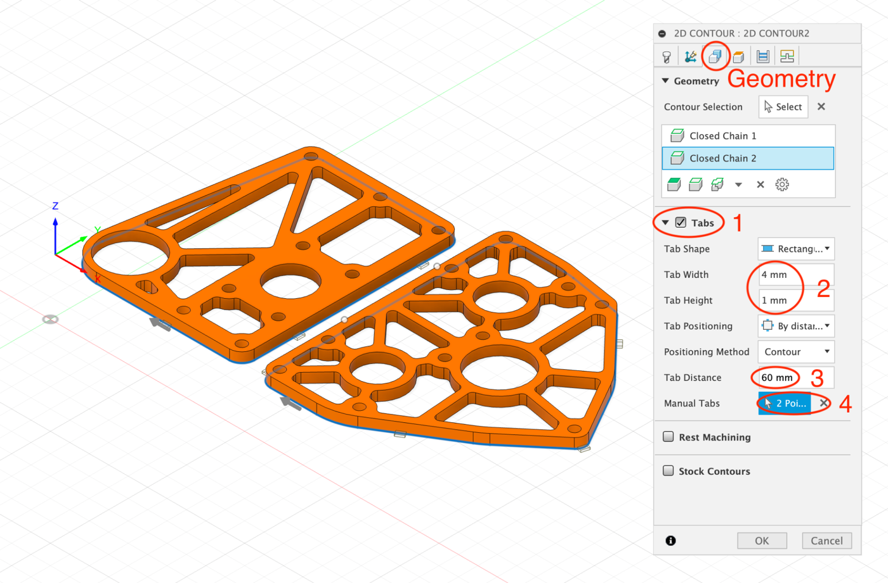

3. In the *heights* tab, ensure the bottom height offset is **-0.5mm** ([refer to *Bore* section](#bore-holes))

4. In the *passes* tab, **tick** *Multiple Depths (1)*, and ensure *Maximum Roughing Stepdown* is **1.6mm** (2)

   Optionally, **tick** *Use Even Stepdowns* (3).

   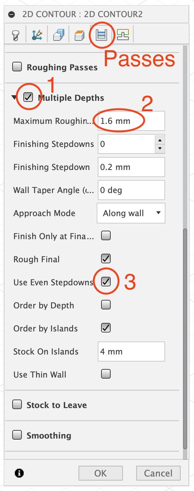

## Adaptive Clearance

1. Select pockets

   This is similar to selecting contours. Ensure the **bottom** edge of the part is selected.

2. In the *passes tab*, set the *Radial Stock to Leave* and *Axial Stock to Leave* as **0mm.**

   \*If the hole is being used for a bearing, set the *Radial stock to Leave* to **0.5mm** and follow the adaptive clearance with the *2D Contour* function.

3. In the *heights* tab, ensure the bottom height offset is **-0.5mm** ([refer to *Bore* section](#bore-holes))

4. In the *linking* tab, set the *Ramping Angle* to **4 deg** and the *Ramp Clearance Height* to **1mm**

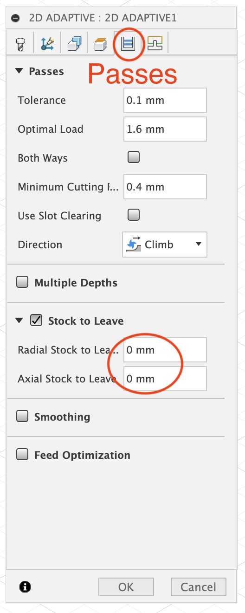 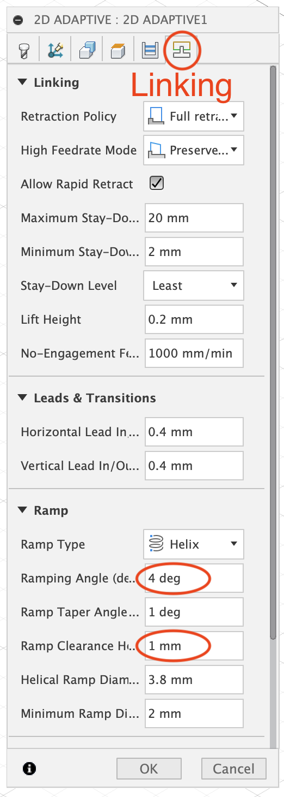

## Final Checks

1. Check the order of operations in the *Setup.*

   Generally the order of operations should be as follows:

   1. *Bore* for bolt / rivet holes
   2. *2D Adaptive* for pocketing
   3. *2D Adaptive* for bearing holes
   4. *2D Contour* for bearing holes
   5. *2D Contour* for the outline of the part.

   ::: warning
   It is critically important that the 2D contour for the outline of the part is the last operation. This is because the part can detach from the spoilboard during this operation (ideally not if tabs are used appropriately).
   :::

2. Simulation & Time

   Ensure the setup is selected (highlighted in grey), and then click simulate.

   Mousing over the green progress bar will indicate how long each operation takes.

3. Double check every operation

   Go through each operation and double check everything.

   Common mistakes include:

   - Not setting the *bottom height offset* to **-0.5mm** on every operation: results in the machine not cutting all the way through the part
   - Not ordering the *2D Contour* for the outline of the part as the last operation: can result in the part becoming loose before the holes are drilled
   - Not setting the *stock height top offset* to **0mm:** results in the machine not cutting all the way through the part
   - Forgetting the *2D Contour* for bearing holes: results in undersized bearing holes
   - Not using *tabs*, or not using enough *tabs:* results in the part becoming loose during the *2D Contour.*
