# Parts & Materials

The standard parts and materials we design with, and where we get them from. For rules on when to use them, see [Design Rules](./design-rules).

Before ordering, check our [stock list](https://docs.google.com/spreadsheets/d/1-WUpauPn0w8gaDgV8chQGcHm4MKQWR08GLBQOgj7PT4/edit?usp=drive_web&ouid=101850487222114186850). For shipping times from each vendor, see [Vendors](#vendors).

## Swerve Modules

The table shows the swerve modules we have, and the motors our sets are set up for.

| Module | Drive ratios | Motor compatibility |
|--------|--------------|---------------------|
| MK4i | L1 (8.14:1), L2 (6.75:1) | Falcon 500 only |
| MK4c | L2+ (5.9:1) | Kraken X60 only |
| MK5n | Three ratios included, changed by swapping only the motor pinion | Kraken X60 drive, Kraken X44 steering |

<figure>
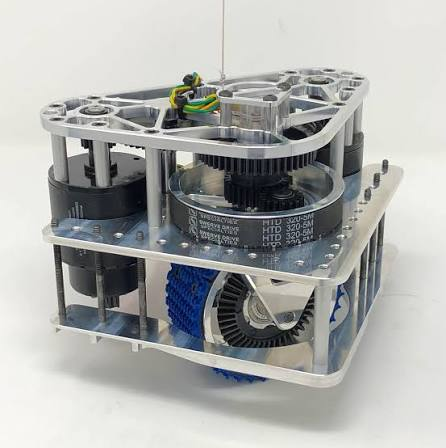
<figcaption>MK4i (image: SDS)</figcaption>
</figure>
<figure>
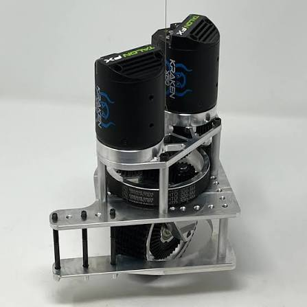
<figcaption>MK4c (image: SDS)</figcaption>
</figure>
<figure>
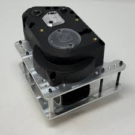
<figcaption>MK5n (image: SDS)</figcaption>
</figure>

Buy modules and spares from [SDS](https://www.swervedrivespecialties.com) (Swerve Drive Specialties) or AndyMark. We get spares such as tread, replacement wheels, belts and different gear ratios from SDS.

## Motors

| Motor | Free speed | Stall torque | Power at 40A | Buy from |
|-------|------------|--------------|--------------|----------|
| Kraken X60 | 6000 RPM | 7.09 Nm | ~410 W | WCP |
| Kraken X44 | 7758 RPM | 4.11 Nm | ~395 W | WCP |
| Falcon 500 | 6380 RPM | 4.69 Nm | ~400 W | No longer available, existing stock only |
| JE (Johnson Electric PLG) | 310 RPM at output | 3.8 ft-lb (~5 Nm) at output | n/a (stalls at 26A) | AndyMark |

<figure>
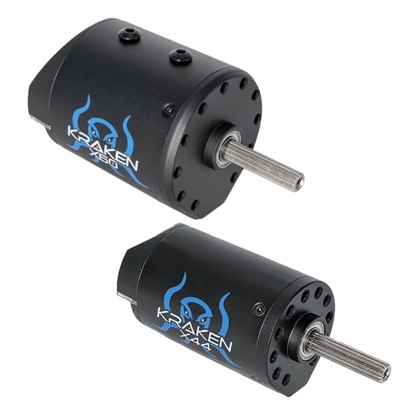
<figcaption>Kraken X60 (top) and X44 (image: WCP)</figcaption>
</figure>
<figure>
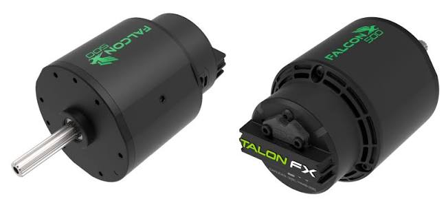
<figcaption>Falcon 500 (image: VEX Robotics)</figcaption>
</figure>

- **Kraken X60** - The most torque. Use it for drivetrains and heavily loaded mechanisms like arms, elevators and climbers.
- **Kraken X44** - Smaller, lighter and faster, with less torque. Use it for rollers, intakes and lighter mechanisms, or where space is tight.
- **JE** - A small brushed gearmotor with a built-in 22.2:1 reduction, so it's reasonably compact and doesn't need a separate gearbox. Use it for low load, low speed mechanisms, e.g. a turret hood or the wrist on an arm.

Krakens and Falcons have a motor controller built in. Brushed motors like the JE need a separate controller, and we use the Talon FXS for all of them, so leave space for it. Compare motors and ratios with [ReCalc](https://www.reca.lc).

## Gearboxes

Check specifically what is available before designing around a gearbox.

| Gearbox | Ratios | Max total reduction | Motors | Buy from |
|---------|--------|---------------------|--------|----------|
| MAXPlanetary | 3:1, 4:1, 5:1 stages, 1:1 brake | 125:1 on all motors | Kraken X44, X60 or Falcon 500 (check hardware availability for Falcon to MAXPlanetary) | REV |
| Sport | Fixed ratios, e.g. 4:1, 16:1, 48:1, 100:1 | 100:1 | Falcon 500. Other motors may be compatible, but not Krakens (we don't have the input hardware) | AndyMark |
| VEX VersaPlanetary | 3:1, 4:1, 5:1, 7:1, 9:1, 10:1 stages | 30:1 on brushless motors | Falcon 500 and all brushed motors | No longer available, existing stock only |

<figure>

<figcaption>MAXPlanetary with 5:1, 4:1 and 3:1 stages, a 60:1 reduction (image: REV Robotics)</figcaption>
</figure>
<figure>
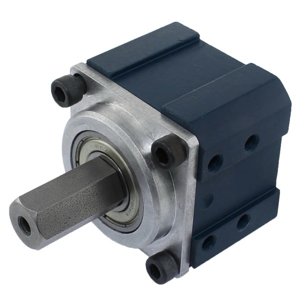
<figcaption>Sport gearbox (image: AndyMark)</figcaption>
</figure>

We have a servo-actuated ratchet available for the Sport gearbox only.

## Gears, Sprockets & Chain

- **Spur gears** - 20DP is our standard, in aluminium and steel.
- **Custom gears** - We can cut custom gears of 12DP or coarser (bigger teeth) on our CNC with a 2mm end mill.
- **Sprockets and chain** - #25 and #35.

<figure>
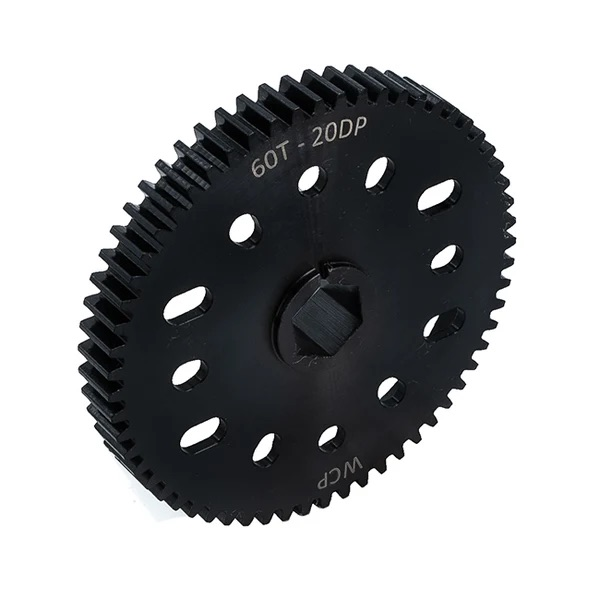
<figcaption>60T 20DP steel spur gear (image: WCP)</figcaption>
</figure>
<figure>
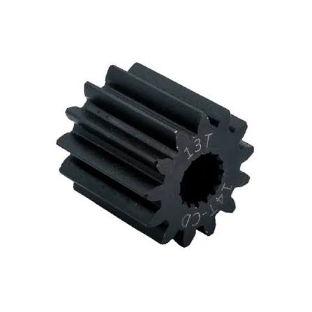
<figcaption>13T pinion, which mounts directly on a motor shaft (image: WCP)</figcaption>
</figure>
<figure>
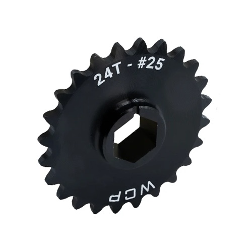
<figcaption>24T #25 sprocket (image: WCP)</figcaption>
</figure>

See [Power Transmission](./design-rules#power-transmission) in Design Rules for when to use steel gears and which chain size.

Buy gears and sprockets from REV or WCP, and chain from WCP. Check the [stock list](https://docs.google.com/spreadsheets/d/1-WUpauPn0w8gaDgV8chQGcHm4MKQWR08GLBQOgj7PT4/edit?usp=drive_web&ouid=101850487222114186850) first.

## Belts & Pulleys

- **Belts** - 5mm HTD preferred, typically 9mm wide. Buy from [PT Parts](https://ptparts.com.au) or [Core Electronics](https://core-electronics.com.au). Check the [stock list](https://docs.google.com/spreadsheets/d/1-WUpauPn0w8gaDgV8chQGcHm4MKQWR08GLBQOgj7PT4/edit?usp=drive_web&ouid=101850487222114186850) first.
- **Pulleys** - We 3D print pulleys for most applications.
- **Prototype belts** - We 3D print belts in TPU 98A for prototyping. See [3D Printing](./3d-printing).

<figure>
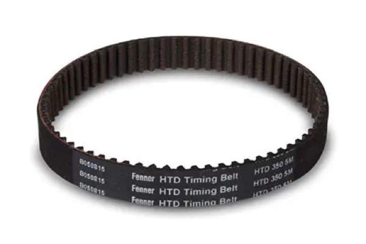
<figcaption>5mm HTD timing belt (image: Fenner)</figcaption>
</figure>

## Shafts

3/8in and 1/2in hex. Prefer 1/2in unless there is a specific design reason, because of hardware compatibility.

Prefer rounded hex for ease of assembly, but some applications may need sharp hex.

<figure>

<figcaption>Rounded hex shaft (image: The Thrifty Bot)</figcaption>
</figure>

Buy from REV, WCP, Thrifty or Grapple.

### Shaft Retention

Screws and spacers are preferred for retaining shafts. We have shaft collars for 3/8in and 1/2in hex, which are fine for prototyping but should be avoided on final robots.

### Spacers

We 3D print spacers, and also stock some standard spacer sizes.

<figure>
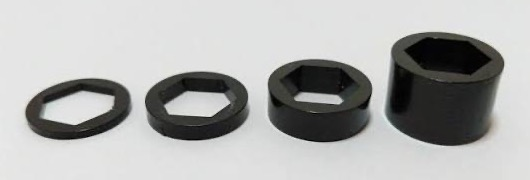
<figcaption>Hex bore spacers (image: The Thrifty Bot)</figcaption>
</figure>

## Bearings

- **Flanged, hex bore** - 1/2in and 3/8in hex. The 1/2in hex bearings are 1.125in OD (see [Design Rules](./design-rules#design-numbers) for the hole size).
- **Flanged, round bore** - Mostly used with rounded hex shafts.
- **Small non-flanged** - For tight spaces. See the Lintake for an example.

<figure>
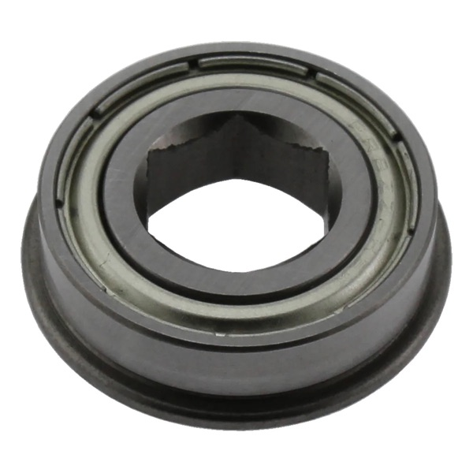
<figcaption>Flanged, hex bore</figcaption>
</figure>
<figure>
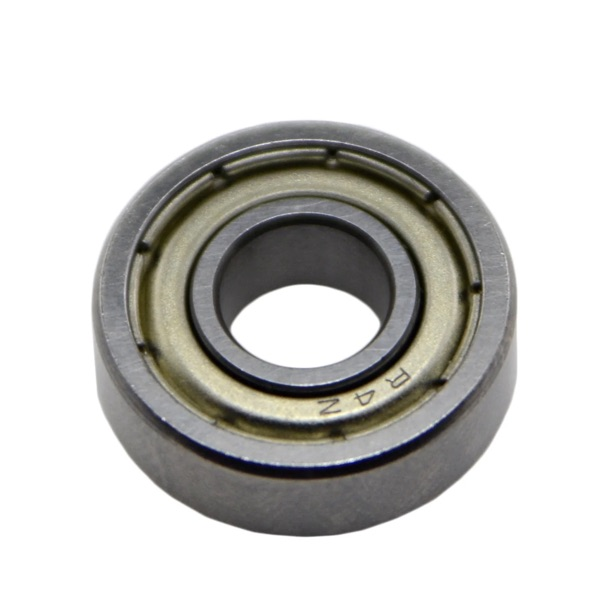
<figcaption>Small non-flanged</figcaption>
</figure>

## Springs

We have constant force springs available. Their sizes aren't documented yet, so check what's in stock.

## Fasteners

Buy fasteners from [Bolt and Nut](https://boltandnut.com.au) unless another vendor is listed below.

### Bolts

- **10-32 UNF** - Use for the vast majority of parts on the robot.
- **8-32** - Only where the hardware requires it, e.g. a VersaPlanetary.
- **1/4-20** - Only where there are specific concerns about bolt strength.

10-32 and 8-32 bolts come in socket head and button head. Use socket heads unless a button head is specifically required. Never use 8-32 button heads, as the risk of stripping them is too high.

<figure>
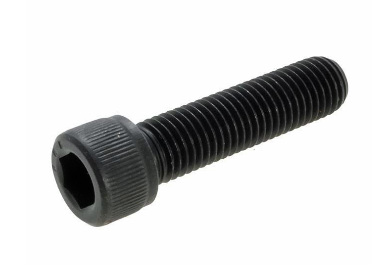
<figcaption>Socket head (image: Bolt and Nut)</figcaption>
</figure>
<figure>
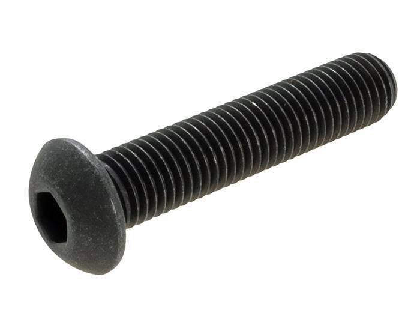
<figcaption>Button head (image: Bolt and Nut)</figcaption>
</figure>
<figure>
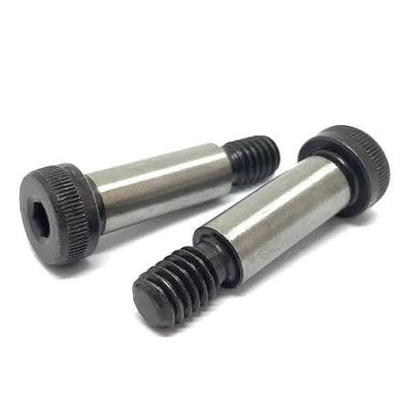
<figcaption>Shoulder bolt (image: Bolt and Nut)</figcaption>
</figure>

### Other Hardware

| Hardware | What we have | Buy from |
|----------|--------------|----------|
| Nyloc nuts | 8-32, 10-32 | Bolt and Nut |
| Rivnuts | 10-32 | Bolt and Nut |
| Rivets | 5mm | Bunnings |
| Shoulder bolts | Some 10-32 with a 1/4in shoulder | Bolt and Nut |
| Inserts for 3D printed parts | 10-32 expanding / heat-set | Thrifty or WCP |
| Metric hardware for 3D printed parts | M3 bolts and heat-set inserts | AliExpress |

### Threadlocker

We use blue Loctite threadlocker in glue-stick form, usually from Supercheap Auto. Never use threadlocker on polycarbonate, as it makes the plastic crack.

<figure>
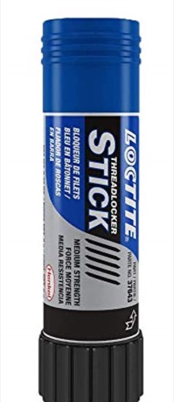
<figcaption>Blue Loctite threadlocker stick</figcaption>
</figure>

## Materials

Custom sizes of any material are available on request.

| Material | What we stock | Buy from |
|----------|---------------|----------|
| Aluminium sheet (5052) | 2.5mm, 5mm | Capral |
| Polycarbonate sheet | 3mm, 4.5mm, 6mm, 9.5mm | Dotmar |
| MDF | 3mm, 6mm, 12mm, 18mm | Bunnings |
| Aluminium extrusion (6061), 2x1 and 1x1 | 0.125in, 0.1in\*, 0.05in\* wall | REV or WCP |

\* VEX sizes. We still have some in stock, but they can no longer be ordered.

<figure>
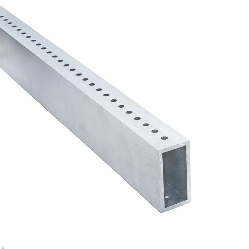
<figcaption>2x1 aluminium extrusion (image: WCP)</figcaption>
</figure>

### Nut Strips & Tube Plugs

- **Nut strips** - Aluminium bars with 10-32 threaded holes at 0.5in spacing, used instead of individual nuts when bolting plates and structure together. Buy from REV or WCP.
- **Tube plugs** - Aluminium plugs that fit into the end of an extrusion, tapped 10-32 on five faces, so you can bolt a plate to the end of a tube. We buy the standard plugs, sized for 1/8in wall extrusion, from WCP, and 3D print sleeves to fit them into thinner-wall tube.

<figure>
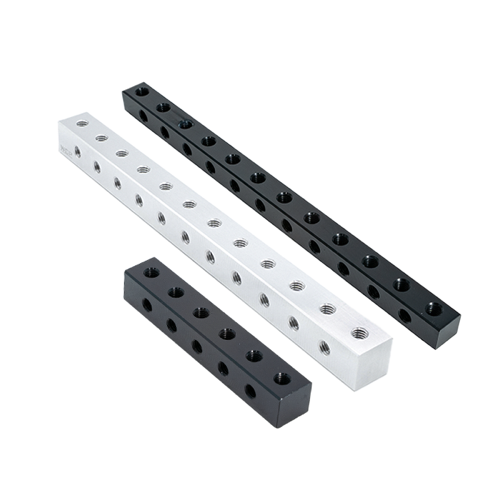
<figcaption>Nut strips (image: WCP)</figcaption>
</figure>
<figure>
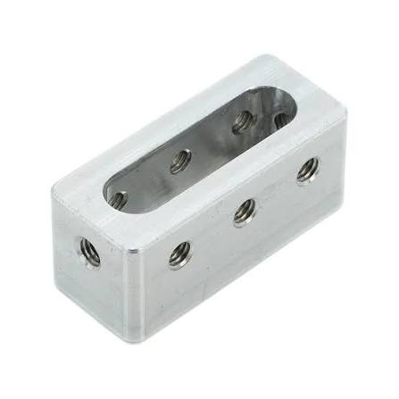
<figcaption>Tube plug (image: WCP)</figcaption>
</figure>

### 3D Printing Filament

See [3D Printing](./3d-printing#filament) for the filaments we use and where to buy them.

## Vendors

### FRC Vendors

Shipping is cheapest from REV Global and AndyMark Sydney, followed by WCP. Everything from REV on this page is available from REV Global, so order from there rather than REV US.

| Vendor | Ships from | Typical delivery | What they offer |
|--------|------------|------------------|-----------------|
| [Grapple](https://grapplerobotics.au) | Canberra | Under 1 week | Australian FRC supplier. Sensors (e.g. LaserCAN) and shafts |
| [WARES](https://warobotics.education) | Perth | Under 1 week | A limited range, including shafts and sensors |
| [REV](https://revrobotics.global) | China (REV Global), or Texas ([REV US](https://www.revrobotics.com)) | Under 1 week from Global, 2-3 weeks from the US | MAXPlanetary gearboxes, gears, sprockets, shafts, nut strips, extrusion and electronics |
| [AndyMark](https://www.andymark.com) | Sydney, or the US | Under 1 week from Sydney, 2-3 weeks from the US | Sport gearboxes, SDS swerve modules and a wide range of FRC parts |
| [WCP](https://wcproducts.com) | California | 1-2 weeks | Kraken motors, gears, sprockets, chain, shafts, nut strips, tube plugs, extrusion and 10-32 inserts |
| [Thrifty](https://www.thethriftybot.com) | Indiana | 1-2 weeks | Low-cost mechanism parts, shafts and 10-32 inserts |
| [SDS](https://www.swervedrivespecialties.com) | US | Variable, often several weeks | Swerve modules and spares (tread, wheels, belts, gear ratios) |

### General Vendors

| Vendor | Typical delivery | What we get from them |
|--------|------------------|-----------------------|
| [Capral](https://www.capral.com.au) | Pick up | Aluminium sheet |
| [Dotmar](https://www.dotmar.com.au) | Pick up | Polycarbonate sheet |
| [Bunnings](https://www.bunnings.com.au) | Pick up | MDF, rivets and general hardware |
| [Supercheap Auto](https://www.supercheapauto.com.au) | Pick up | Blue Loctite threadlocker |
| [Amazon](https://www.amazon.com.au) | 2-3 days | eSun 3D printing filament and general items |
| [Bolt and Nut](https://boltandnut.com.au) | About 1 week | Fasteners |
| [PT Parts](https://ptparts.com.au) | About 1 week | Belts |
| [Core Electronics](https://core-electronics.com.au) | About 1 week | Belts |
| [Bambu Lab](https://bambulab.com) | About 1 week | 3D printing filament |
| [AliExpress](https://www.aliexpress.com) | Variable, often several weeks | Cheap metric fasteners, e.g. heat-set inserts and M3 bolts |
