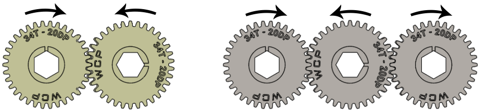
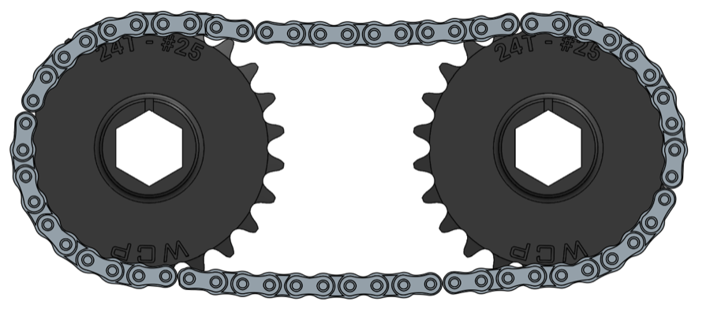
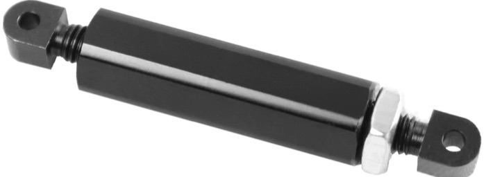
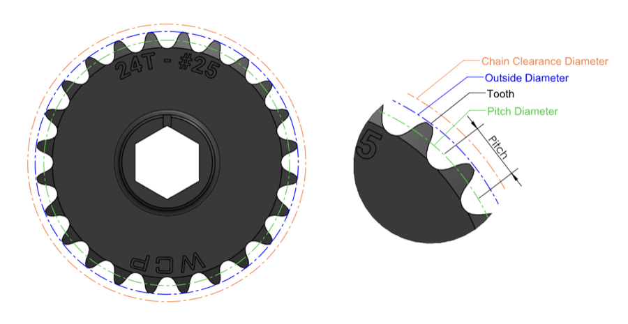
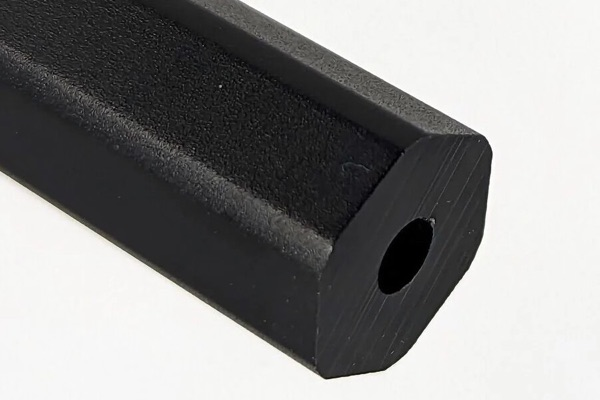
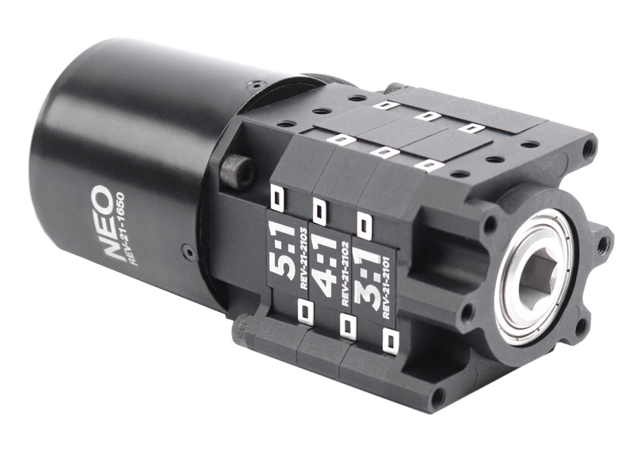

# Power Transmission Basics

Power transmission is how we get power from a motor to the thing it moves: a wheel, a roller, an arm or an elevator. Nearly every mechanism on the robot uses gears, belts or chain, so this is worth understanding before you design one.

For our rules on which to use, see [Power Transmission](./design-rules#power-transmission) in Design Rules. For the parts we buy, see [Parts & Materials](./parts-and-materials).

## Why We Need It

FRC motors spin very fast with very little torque. A Kraken X60 spins at 6000 RPM, but an arm might only need to turn at 60 RPM and an intake roller at 1000 RPM. Power transmission does two jobs:

- **Changes speed and torque** - slowing a motor down gives more torque, and speeding it up gives less.
- **Moves power somewhere else** - the motor rarely fits right where the power is needed.

## Gear Ratios

A gear ratio compares the size (measured in teeth) of the output gear to the input gear. 

$$\text{ratio} = \frac{\text{output teeth}}{\text{input teeth}}$$

A 12 tooth gear driving a 60 tooth gear is a 60/12 = 5:1 reduction. The output turns 5 times slower, with 5 times the torque:

$$\text{output speed} = \frac{\text{input speed}}{\text{ratio}} \qquad \text{output torque} = \text{input torque} \times \text{ratio}$$

The same idea works for pulleys and sprockets: count the teeth on each.

- **Reduction** (ratio above 1:1) - output is slower than the input, with more torque. Most mechanisms need this.
- **Step-Up** (ratio below 1:1) - output is faster than the input, with less torque. Only rarely used for some mechanisms like shooter flywheels.

### Stages

One gear pair can only give so much reduction before the small gear gets too small or the big gear gets too big. For larger reductions we use several stages, and multiply them together:

$$\text{total ratio} = \text{stage 1} \times \text{stage 2} \times \dots$$

For example, a 5:1 and 4:1 MAXPlanetary stage followed by an 18T to 36T belt (2:1) gives 5 × 4 × 2 = 40:1.

## Direction

- **Meshing gears** turn in opposite directions.
- **Belts and chain** turn both ends in the same direction.
- **Idler gear** - a gear (of any size) placed between two others (of the same size) reverses the direction without changing the ratio.

<figure>

<figcaption>Left: meshing gears turn in opposite directions. Right: with an idler in the middle, the outer gears turn the same way. (Image: WCP)</figcaption>
</figure>

Direction can be flipped in code, so it only matters mechanically when two things driven by one motor need to turn a particular way relative to each other, e.g. the top and bottom rollers of an intake.

## Gears, Belts and Chain

| | Gears | Belts | Chain |
|--|-------|-------|-------|
| Distance between shafts | Short, set by gear size | Any | Any |
| Weight | Heavy in steel, lighter in aluminium | Light | Medium |
| Tensioning | Not needed | Needs to be tensioned | Needs tensioning, and stretches over time |
| Lengths | n/a | Fixed lengths only | Cut to any length |
| Strength | High in aluminium, very high in steel | Can skip teeth under high load | High |
| Shock loads | Teeth can crack or strip | Can skip teeth | Handles them well |

### Gears

Gears mesh directly, so they are compact and never slip. The shafts must be exactly the right distance apart.

- **Material** - aluminium gears are lighter, and steel gears are stronger.
- **Diametral Pitch (DP)** - the tooth size. Gears only mesh with gears of the same DP. Our standard is 20DP. A higher DP means smaller teeth.
- **Pressure angle** - the angle the teeth push on each other at, set by the tooth shape. Gears must have the same pressure angle as well as the same DP to mesh properly. Most FRC COTS gears are 14.5°. Check the pressure angle when mixing gears from different vendors, and when generating custom gears in CAD.
- **Pitch diameter** - the effective size of the gear, where the teeth meet. For a gear with $N$ teeth:

$$\text{pitch diameter (in)} = \frac{N}{DP}$$

- **Centre to centre (C-C) distance** - half the sum of the pitch diameters:

$$\text{C-C (in)} = \frac{N_1 + N_2}{2 \times DP}$$

For 20DP, a 12T and 60T gear are (12 + 60) ÷ 40 = 1.8in apart.

- **Backlash** - the small gap between meshing teeth, which causes play in a mechanism. Some is needed so the gears don't bind. Spacing gears slightly further apart than the exact C-C (e.g. +0.003in) allows for manufacturing tolerances, so the gears don't bind or have tight spots.

### Belts

We use timing belts, which have teeth that mesh with the pulleys. They are light, quiet, can span any distance and need little maintenance, which is why we [use them first](./design-rules#power-transmission).

- **Pitch** - the distance between teeth. HTD 5mm belts have 5mm between teeth.
- **Width** - wider belts carry more load. We normally use 9mm.
- **Fixed lengths** - belts only come in set lengths (a whole number of teeth), so the C-C distance is set by the belt you choose. Use [ReCalc](https://www.reca.lc) to find the C-C for a given belt and pulleys.
- **Tension** - a loose belt skips teeth under load. Design the C-C to suit a real belt length, or add a tensioner.
- **Teeth in mesh** - small pulleys have few teeth touching the belt, so they skip more easily. This is why we keep pulleys 18T or larger.

### Chain

Roller chain is strong, handles shock loads better than gears, and can be cut to any length, but it is heavier than belt, stretches over time and needs tensioning.

<figure>

<figcaption>#25 chain on two 24T sprockets (image: WCP)</figcaption>
</figure>

- **Size** - #25 has a 1/4in pitch and #35 has a 3/8in pitch. #35 is stronger and heavier. See [Chain Size](./design-rules#power-transmission) for when to use each.
- **Links** - chain is joined with a master link, and normally needs an even number of links. A half link allows an odd number, but it is weaker.
- **Tensioning** - use turnbuckles or a tensioner. A slack chain adds backlash (play), which makes mechanisms like arms and elevators hard to position accurately.

<figure>

<figcaption>Turnbuckle for tensioning chain (image: REV Robotics)</figcaption>
</figure>

<figure>

<figcaption>Sprocket diameters. Leave room for the chain clearance diameter, not just the sprocket's outside diameter. (Image: WCP)</figcaption>
</figure>

## Shafts and Bearings

Gears, pulleys and sprockets sit on shafts, and shafts spin in bearings.

- **Hex shafts** - most FRC shafts are hexagonal, so parts with a hex bore turn with the shaft without needing keys or set screws. We use 1/2in and 3/8in hex (see [Shafts](./parts-and-materials#shafts)).
- **Rounded hex** - hex with rounded corners, so it can also spin inside round bore bearings.
- **Support both ends** - a shaft supported at only one end (cantilevered) bends under load, which makes gears skip and bearings wear. Support shafts at both ends where possible.
- **Retention** - everything on the shaft needs to be held in place along its length, or parts will slide and fall off. See [Shaft Retention](./parts-and-materials#shaft-retention).

<figure>

<figcaption>Rounded hex shaft (image: The Thrifty Bot)</figcaption>
</figure>

## Gearboxes

A gearbox packages one or more gear stages together.

- **Planetary gearboxes** - COTS gearboxes (e.g. MAXPlanetary) where small gears orbit around a central gear inside a ring. They are simple to use, compact and in line with the motor, and the ratio is easy to change by swapping stages. See [Gearboxes](./parts-and-materials#gearboxes) for the ones we have.
- **Spur gearboxes** - custom gearboxes we design and make ourselves, using regular gears side by side between plates. They take more work, but can be packaged to fit the mechanism, offset the output from the motor, and combine multiple motors onto one output.

<figure>

<figcaption>MAXPlanetary with 5:1, 4:1 and 3:1 stages, a 60:1 reduction (image: REV Robotics)</figcaption>
</figure>

## Choosing a Ratio

::: warning
Consult a mentor for advice when choosing a ratio.
:::

1. Work out what the mechanism needs: how fast it moves, and how much load it carries (e.g. arm weight and length, or game piece speed).
2. Pick a motor. See [Motors](./parts-and-materials#motors).
3. Enter both into [ReCalc](https://www.reca.lc) and adjust the ratio until the speed and torque both work with margin.
4. Split the ratio into stages using the gearboxes, gears, pulleys and sprockets we have.
5. Check C-C distances with a calculator, and check the parts are in stock. See the [CAD Checklist](./cad-checklist#power-transmission).
