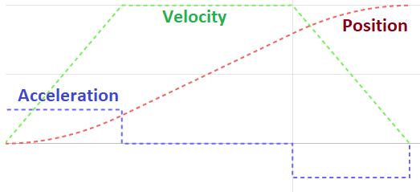
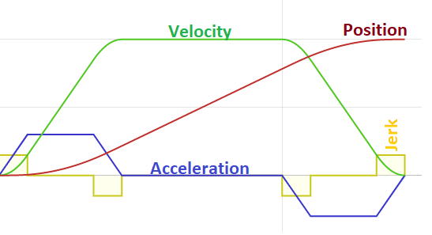

# Mechanism Structure

Mechanisms are typically a thin wrapper around a motor controller, providing some abstraction over the lower-level controller interface, and some internal state. Because most of the complicated control is handled in the manipulator, the mechanisms tend to be mostly the same, allowing for different mechanism types, which can be broadly placed in three categories: rollers, set-speed, and positional.

**Roller** mechanisms are the simplest, not requiring any closed-loop control, as exact speeds are typically not important. The most common example is an intake roller. On Lemon Launcher, the spindexer and kicker are also roller mechanisms.

**Set-speed** mechanisms are a step up from rollers, where closed-loop velocity control is required, requiring more tuning. They are the least common, typically only being seen in flywheel shooters.

**Positional** mechanisms are the most complicated, as they require tuning for driving to/holding exact extensions/angles. Additionally, because they involve parts of the robot moving in relation to each other, positional mechanisms have safety concerns with hard stops/limit switches and safety interlocks. The most common examples of positional mechanisms are elevators and pivots. On Lemon Launcher, the hood and turret are also positional mechanisms.

The methods for each mechanism can be organised into four sections: construction, lifetime, state, and operation. They are organised into these sections in both the `.h` and `.cpp` files in the same order to help with readability. Do note that not every mechanism has every one of the listed methods, for instance some positional mechanisms do not have limit switches.

## Construction - basic object creation

- `Constructor()`: default constructor, only responsible for variable initialisation not handled in the header file.
- `Destructor()`: calls the shutdown function to ensure the mechanism is destroyed gracefully.

## Lifetime - initialisation

- `Setup()`: configures the motor controller(s) and initialises any complex state.
- `Shutdown()`: contains any operations required to ensure object destruction occurs gracefully.
- `Periodic()`: contains any operations to be executed every loop. Called in Manipulator periodic.
- `UpdateSimulation()`: simulation-specific periodic tasks for updating the simulated motor controller and other simulated mechanism state.

## State - feedback for control

- `GetOutput()`: get motor output as a percentage [-1, 1].
- `GetCurrent()`: get the current applied to the motor.
- `GetVelocity()`: *set-speed only.* Get the motor/output shaft velocity in rpm.
- `GetPosition()`: *positional only.* Gets the position of the mechanism in the relevant unit (inch for elevator, degrees for pivot). Will often be named for the specific quantity (`GetExtensionInch`, `GetAngleDegrees`).
- `IsPositionSet()`: *positional only.* Returns whether the mechanism has a set point or if it was last moved manually.
- `Get<Forward/Reverse>LimitSwitch()`: *positional only.* Get the state of each limit switch.
- `GetMechanismPosition(motor pos)`: *positional only.* Get the position of the mechanism for a given motor position.
- `GetMotorPosition(mechanism pos)`: *positional only.* Get the position of the motor for a given mechanism position.

Very complex mechanisms may have additional state that requires additional methods.

## Operations - motor control

- `ManualDrive(percentage output)`: drive the mechanism in open-loop at the provided percentage output (actually assigns a voltage but same thing (mostly)).
- `VelocityDrive(rpm)`: *set-speed only.* Drive the motor in closed-loop at the provided velocity.
- `SetPosition(position)`: *positional only.* Drives to the specified position in closed-loop. As these can be motion magic/position hybrid control, they often need to be called every period so the control request is changed at the selected tolerance. The position type depends on the exact mechanism, similarly to `GetPosition()`.
- `SetupMotionMagic(factor)`: *positional only.* Configures the motion magic scaled by the given factor. Often only run once at setup.
- `TestDrive(joystick)`: special tuning mode for initial mechanism setup. Takes the joystick object, rather than a single input, meaning that it is used in place of other `DoJoystickControl` functions at the manipulator level.

More complex mechanisms can have specialised control operations beyond these.

## Setup Details

The `Setup()` method is responsible for deploying the configuration for each mechanism to its motor controller(s). As with the other components, the configuration tends to be similar between mechanisms, just with different numbers. The configuration itself is done in chunks, which we lay out in the same order to ensure consistency.

The following list does not include every component of the CTRE motor configuration, only the ones we have ever used.

### Motor Output

Controls motor output limits, polarity and neutral mode.

- `PeakForwardDutyCycle`: maximum duty cycle (speed control by turning power to motor on/off) in the forward direction. Always set to 1.0 (fully on), but we don’t use duty cycle control requests.
- `PeakReverseDutyCycle`: maximum duty cycle (speed control by turning power to motor on/off) in the reverse direction. Always set to -1.0 (fully on), but we don’t use duty cycle control requests.
- `NeutralMode`: either brake or coast. In coast mode, when the motor is off, it decelerates purely under friction, good for roller or fixed-speed, and is necessary for flywheels to prevent damage to belts/pulleys. In brake mode, the motor uses back-current to brake itself more quickly (similar to regen braking in a car, NOT the same as the controller providing a reverse voltage to drive to zero), which is good for preventing overshoot on positional mechanisms.

### Feedback

Controls how sensor data is integrated.

- `SensorToMechanismRatio`: used to integrate a gear ratio onto the motor controller, meaning it returns the mechanism angle, removing the need for conversion methods, and enabling more complex control. Typically avoided except when needed as convention.

### Voltage

Sets motor output voltage limits.

- `PeakForwardVoltage`: maximum voltage in the forward direction. Implemented as a dynamic duty cycle that maintains output voltage. Always set to 12V (fully on).
- `PeakReverseVoltage`: maximum voltage in the reverse direction. Implemented as a dynamic duty cycle that maintains output voltage. Always set to -12V (fully on).

### Open-loop Ramp Rate

Controls how fast the motor output can change in open-loop control.

- `VoltageOpenLoopRampPeriod`: time to ramp up controller output voltage from 0 to full voltage (12V) in voltage open-loop. Can help to cap acceleration to reduce damage to belts (and indirectly limit current, but that is also done separately). Separate limits exist for duty cycle and torque-current controls. Typically set as small as possible to reduce interference with braking to an operator-specified position.

### Closed-loop Ramp Rate

Controls how fast the motor output can change in closed-loop control.

- `VoltageClosedLoopRampPeriod`: time to ramp up controller output voltage from 0 to full voltage (12V) in voltage closed-loop controls. Can help to cap acceleration to reduce damage to belts (and indirectly limit current, but that is also done separately). Separate limits exist for duty cycle and torque-current controls. Typically set to a very small value so as to not interfere with closed-loop setpoints.

### Current Limits

Set peak and continuous limits for both the supply and stator current.

- `Supply/StatorCurrentLimitEnable`: always set to true, ensures that the values are actually used.
- `SupplyCurrentLimit`: value depends entirely on the mechanism/motor. Used to set the absolute peak current drawn from the PDH to the input of the controller.
- `SupplyCurrentLowerTime`: time for which the peak limit current can be drawn, after which the limit changes to the supply current lower limit. Typically we use 0.5s, but it can depend on the mechanism.
- `SupplyCurrentLowerLimit`: value depends entirely on the mechanism/motor. Used to set the lower current limit drawn from the PDH to the input of the controller, used after the timeout on the peak limit.
- `StatorCurrentLimit`: value depends entirely on the mechanism/motor. Used to set the current limit in the motor coils at the output of the motor controller, both for motoring and braking. Typically higher than the supply current.

### PID Slots (0, 1, 2, 3)

Set gain values for each of the four closed-loop control profiles. Each of the gains can be set separately for each profile, which is then selected as part of each closed-loop control request. Typically we use slot 0 for velocity controls (including Motion Magic), and slot 1 for position control.

- `kG`: accounts for asymmetry of gravity applying to mechanisms.
- `withGravityType`: either elevator or arm (pivot), controls how kG is applied. For elevator, applies as a fixed offset in the positive direction, so additive to lift the elevator, then subtractive to slow lowering. For pivots, kG is applied according to the cosine of the angle of the mechanism. This requires integrating the motor-to-mechanism ratio in the configuration so that the motor knows the mechanism position, and setting the zero position of the motor when the arm is horizontal (maximum gravity), and up is positive for the motor.
- `kS`: accounts for friction in the motor/mechanism.
- `StaticFeedforwardSign`: either velocity or closed-loop sign, controls how kS is applied. With velocity sign, used for fixed-speed, kS applies in the direction of motion. With closed-loop sign, used for position control, kS applies in the direction of the setpoint.
- `kV`: velocity feed-forward, expected voltage required for a given speed (velocity only).
- `kP`: proportional closed-loop gain. Multiplied by the closed-loop error as a correction.
- `kD`: derivative closed-loop gain. Multiplied by the derivative of the closed-loop error over time to reduce overshoot.
- Also `kI`, `kA`, other stuff we don’t use.

### Hard Limit Switches

Configure behaviour for hardware limit switches.

- `Forward/ReverseLimitEnable`: always true, ensures the limit switch is respected.
- `Forward/ReverseLimitSource`: tells the motor where the limit switch signal is from. We only ever use `LimitSwitchPin` (limit switch plug on Falcons), but could include from CANdi devices, other motor, CANcoder, CANifier, CANrange.
- `Forward/ReverseLimitType`: either normally open or normally closed, tells the motor what wiring configuration the switch uses. We typically use normally open.
- `Forward/ReverseLimitAutosetPositionEnable`: whether we want to reset the motor position to a known value when the limit switch is triggered.
- `Forward/ReverseLimitAutosetPositionValue`: position to reset the motor position to on limit switch trigger.

### Soft Limit Switches

Configure behaviour for software limit switches.

- `Forward/ReverseSoftLimitEnable`: always true, ensures soft limit is respected.
- `Forward/ReverseSoftLimitThreshold`: motor position to enforce the limit.

### Motion Magic

Configure Motion Magic values for motion profiling. This is a somewhat special part of the config, typically done in a separate function, called during setup with default values, but allows for re-defining based on a scale factor if necessary.

- `MotionMagicCruiseVelocity`: set the max velocity for the motion profile (top of velocity curve).
- `MotionMagicAcceleration`: set max acceleration for the motion profile (slope of ramp-up/ramp-down).
- `MotionMagicJerk`: set max jerk for the motion profile (slope of acceleration/rounded corners on velocity profile).

<figure>

<figcaption>Trapezoidal profile (cruise velocity and acceleration)</figcaption>
</figure>

<figure>

<figcaption>S-profile (trapezoidal + jerk). Images from <a href="https://xenovacivus.github.io/s-vs-t-curve/s-vs-t-curve.html">xenovacivus.github.io</a></figcaption>
</figure>
