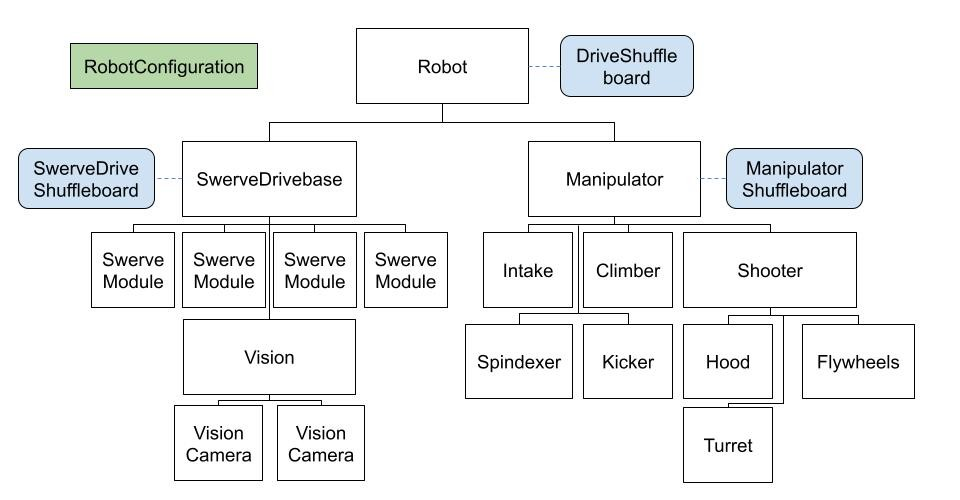

# Software Organisation

This document describes how we organise software documents on Google Drive and software source code in GitHub. Having rules and guidelines for this is important to allow a team to work together within one season and also to maintain information from one season to another. Please try to keep things organised. It does not matter if you make a mistake, just don’t be offended if someone asks you to make changes to follow these guidelines.

## Google Drive

Software documents are stored in the Software folder of the KoalafiedShare. The following describes how documents are organised into different folders. Please try to avoid making large numbers of new files, or any new folders. If you have ideas for changes please discuss them with mentors. If you need to create a new document for getting down some ideas, create it in the root Software folder and it can be moved later if required.

| Folder | Description |
|--------|-------------|
| `<Root>` | The root of the software folder is used for documents relating to the current season.<br><br>Plus it also has a small number of important permanent documents, for example, the software setup guide. |
| `Archive/<Archive Year>` | An archive of documents from previous seasons. At the end of each season, a subfolder is created named after the year (eg ‘2018’) and all documents specific to that year are moved into it. |
| `Documentation` | General internal documentation that can be built on from year to year that is not specific to any year, such as ‘how to tune PID loops’. Documents published externally such as white papers. |
| `Training` | Documents related to software training. |

## GitHub Repositories

GitHub as a website that provides software source control. It is used to store all our software code and track all the changes we make to it. The setup guide contains the instructions to get access to GitHub and get a copy of our software code. To learn about GitHub you can try one of the following.

- Talk to the mentors. This is the best place to start.
- Watch this [tutorial video](https://www.youtube.com/watch?v=0fKg7e37bQE). Teaches the basics if you have 20 minutes to spare.
- Read the definitive book on the subject, [Pro Git](https://git-scm.com/book/en/v2). Probably do not do this until you decide to commit your life to software.

### Repository Names

We have multiple repositories named as follows:

- **public** - This is our public repository that is it is viewable by anyone in the world. It contains a version of all of our code from previous seasons. So that we can base code for a season on our previous work it is necessary for that work to be public, according to rule [R303](https://www.frcmanual.com/2024/robot-construction-rules#r303-create-new-designs-and-software-unless-theyre-public). (Actual there is disagreement as to whether you have to publish the full source code but we, and most teams, believe it is required).
- **`Koalafied_<year>`** - The code developed each year goes into a new repository, for example, Koalafied_2024 for the 2024 season. Note that the year in the repository name refers to the version of WPILib that applies to the code. For example, if we take the 2023 robot code and upgrade it to use the 2024 version of WPILib then that will be done in the Koalafied_2024 repository. This means that during each season we only need to work with one repository.
- We also have a number of randomly named repositories from before we adopted the convention.

### Repository Structure

As a repository holds all the code developed in one year, which can include work on multiple robots. So the highest level of directories in the repository is for the different robots. The directory for a robot is formatted using the year of the game and the name of the game without spaces, eg. 2024_Crescendo or 2023_ChargedUp.

Within each robot directory, there can be code from multiple platforms that the robot uses. This will always include the RoboRIO code, but may also include code for controlling LEDs or code for vision processors.

```
Koalafied_2024\
    2023_ChargedUp\
        RoboRIO\
        LEDs\
    2024_ChargedUp\
        RoboRIO\
        LEDs\
        Vision\
```

Do not ever use spaces in directory or file names. Most tools can handle this, but not all of them. In particular, spaces will prevent double-clicking an error taking you to the location of the error in VS code.

### Branching Policy and Naming

A key feature of Git is to use a lot of branches. However, a common set of guidelines on how branches are used and named makes it easier for the team to work on the code together.

On your local Git repository, you can use branches however you like. For branches on GitHub please use descriptive names and include your name in the branch name if it is a branch just for something you are working on, e.g. ‘Nick_NewIntake’.

## Software Structural Overview


