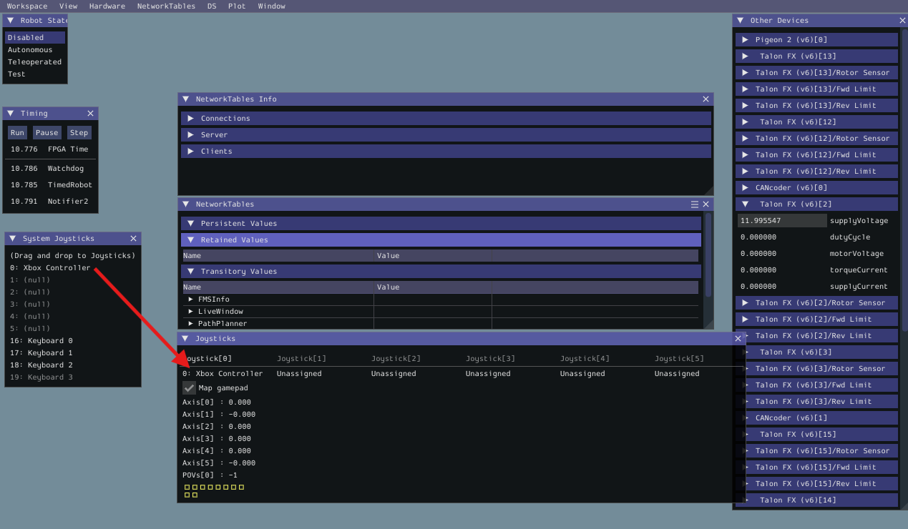

# FRC Software Setup Guide

This page outlines the setup for software development for. Mostly the WPILib instructions for setup are pretty good so we reference them, but with notes about the options you should use when there are choices. This guide assumes you can quickly download the required files. You can also get the files from another computer on USB, but that is more messing around, so just download things if you can (just maybe not on mobile data as they are quite big).

::: warning NOTE
Building and simulating code requires a reasonably powerful computer, with ideally 32GB of RAM for simulation. 16GB can also work depending on the computer but will probably be slower.
:::

## Software Development Tools

The key tools that must be installed for software development are as follows. For just compiling software and simulating on your computer you need WPILib and FRC PathPlanner, but not the FRC Game Tools or Phoenix Tuner X.

- Install the WPILib as described [here](https://docs.wpilib.org/en/stable/docs/zero-to-robot/step-2/wpilib-setup.html). This gives you everything you need to write, build and deploy robot code written in C++ (the language we use).
  - May have Windows security stop install, click ‘more info’ then ‘install anyway’
  - Select to install everything.
  - Select the ‘Download for this computer only (fastest)’ option for VS Code.
  - Do the ‘Additional C++ Installation for Simulation’. The WPILib installation guide contains the instructions for Windows machines, for macOS, the following steps are necessary.
- Install the FRC Game Tools as described [here](https://docs.wpilib.org/en/stable/docs/zero-to-robot/step-2/frc-game-tools.html). NOTE: This software is for Windows only.
  - Make sure to create an account to download the file.
  - When downloading from the NI website select INSTALL OFFLINE and choose the most recent version (top one).
  - Uninstall (if required) and install are very slow and require a reboot, just be patient.
  - When prompted to disable Windows Fast Startup you do not need to do this for a development machine, but should do it for an actual drive station computer that will be used in competition.
  - Skip the Activate Software step by just closing the window with the X in the top right.
- Download Phoenix Tuner X from the [Microsoft Store](https://apps.microsoft.com/detail/9nvv4pwdw27z?hl=en-us&gl=AU). Documentation is [here](https://v6.docs.ctr-electronics.com/en/stable/docs/tuner/index.html). NOTE: This software is for Windows only.
- PathPlanner is a software library that we use to get the robot to follow a path autonomously. It also has an app for graphically editing paths that are installed using Microsoft Store or App Store (Mac), and searching for ‘FRC PathPlanner’.

## Utility Software

### Git Client

Our software is stored on GitHub and so it is necessary to have a Git client to access it. It is strongly recommended to install GitHub Desktop, which can be downloaded [here](https://desktop.github.com/).

Running the installer will install GitHub Desktop. There are no options.

### FTP Client

During software development and testing it is sometimes necessary to transfer files to and from the RoboRIO using FTP. This requires a FTP client of some kind. One good option is FileZilla, which can be downloaded [here](https://filezilla-project.org/download.php?type=client).

Accept all the default options, except the avg browser, which you do not need to install.

## Getting Our Software from GitHub

GitHub is the place where we store and share our software.

1. Create a [GitHub account](https://github.com) if you do not have one, and ask a mentor either at a meeting or on Slack #team-software to be added to the Koalafied GitHub.
2. Clone the repo for the current year, for example, **Koalafied_2025** for the 2025 code. choice. The easiest way to do this is in GitHub Desktop: **File>Clone New Repository**. Put the repository somewhere that you can easily find it.

## Running the Software On the Simulator

The following setup-by-step instructions should get you to the point where you can simulate the robot code on your computer. To do this it is nice to have an Xbox controller. If you don’t have one, you may be able to borrow one from the team or purchase a cheap one. They are available for under $20 from eBay. The quality is not great, but that is fine for simulation. If you do not have a controller then you can use the keyboard, but this is quite fiddly.

1. Run **2025 WPILib VS Code**.
2. Use **File>Open** folder and choose a folder with the RoboRIO code. This will be the RoboRIO directory inside the parent directory for the robot.
3. Do the **WPILib: Simulate Robot Code** command in VS Code. Click on the icon with the ‘W’ in a red hexagon on the top right and select the command from the list.
4. Wait for the popup, this will take a long time (minutes) initially because it has to download a bunch of library code. If you click on something else while waiting it may not appear. Leave just **Sim GUI** checked. Click **OK**.
5. Start the Elastic. Try `<Windows Key>` and start typing “Elastic”.
6. Connect an Xbox controller and then in the simulation GUI window drag the joystick from the **System Joysticks** panel to the **Joysticks** panel. You should see the number change when you move the controller joysticks.

   

7. Click **Teleop** in the simulation GUI window.
8. Select the **Drivebase** tab in the shuffleboard
9. Drive the robot using the joystick. You should see the robot moving on the field widget in the shuffleboard **Drive** tab.
10. Alternatively, select an auto path in the shuffleboard and click **Autonomous** in the simulation GUI window.

## Firmware

Firmware is the software that runs on the robot’s RoboRIO, Radio, or motor controllers and sensors. Firmware always needs to be updated at the beginning of each season to match the new WPILib, and usually also needs to be updated within the season, possibly multiple times, as bugs are corrected.

You do not need to do anything with firmware just to run simulated code.

### RoboRIO

How to image the RoboRIO is described [here](https://docs.wpilib.org/en/stable/docs/zero-to-robot/step-3/imaging-your-roborio.html). The RoboRIO Imaging Tool is installed as part of FRC Game Tools and starts with the first version of the RoboRIO image for the FRC season. There are sometimes updates and these must be installed ASAP, as they are required to be allowed to compete (remind Nick of this). Note that there is now a new version of the RoboRIO called the RoboRIO2. You will see firmware for it in the imaging tool but it will be greyed out as the tool knows it should not be used with the old RoboRIOs that we have. There are two options:

- **Format Target** - This is what you want almost all the time. It installs a new OS image for the RoboRIO. There are generally multiple release of this image each season.
- **Update Firmware** - This options installed new low level firmware on the RoboRIO (something like the BIOS on a PC). This does not need to be done every season and would only normally be required for a RoboRIO that has been in a drawer for years.

### CAN Devices

The CAN devices on the robot all have firmware that needs to be updated, although not everything updates every year. This covers the VRM, PCM, Talon SRXs, Falcon FXs, Pigeon IMU and CANcoders. The update is performed using Phoenix Tuner X as follows:

1. Connect to the robot via WiFi and run Phoenix Tuner X.
2. Click the top-left burger menu, and select Driver Station as the connection method at the bottom. Note that this requires that you have the driver station open. If there is no robot software running you should also do **Run Temporary Diagnostic Server**.
3. Select a device and scroll to the firmware version option in the controller setup menu. Select the version you would like to flash to the device and update the controller's configuration. Multiple devices can be selected from the main screen and updated to the latest version simultaneously. The green outline indicates no update, yellow is an optional update, and red is a critical update.

### Radio

To program the radio follow the [WPILib instructions](https://docs.wpilib.org/en/stable/docs/zero-to-robot/step-3/radio-programming.html).

- Always use a WPA Key (aka WiFi password) otherwise Windows will treat the network as unsafe, ports will be blocked and things will not work.
- Record the password on the radio so people can find it easily
- Always make the password ‘koalafied’.
- Look at the picture on the radio programming tool carefully. The correct ethernet port to connect to has changed over time.
- To image a radio out of the box, an installation of [npcap 1.60](https://npcap.com/dist/) is required.

At competitions, the radio is reprogrammed with special firmware that is just for that particular event. After the competition, the radio needs to be reprogrammed as above for normal use. [WPILIB Networking Introduction](https://docs.wpilib.org/en/stable/docs/networking/networking-introduction/networking-basics.html) - contains a good introduction to networking, plus important FRC-specific information about how things work for development, in the pits and on the field with the FMS.

::: warning NOTE
Radios have changed a lot for 2025. We need to update this!
:::
