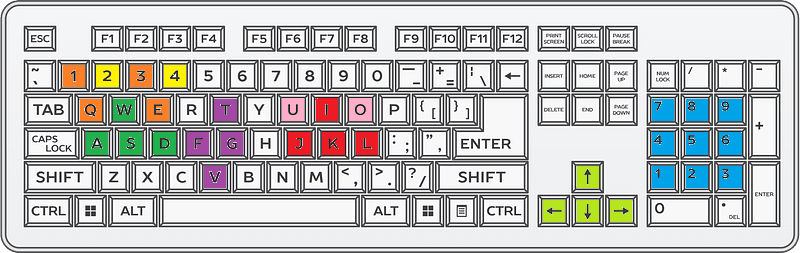

# Software Simulation

## Setup For 3D Simulation in AdvantageScope

These instructions describe how to set up AdvantageScope to display a 3D simulation of our robot once a model has been created for it. Currently, there is only a model for our 2023 robot.

1. Use the **WPILib:Simulate Robot Code** command in VSCode to build the software for simulation and start simulating.
2. Use the **WPILib:Start Tool** command in VSCode and select to run AdvantageScope.
3. In AdvantageScope, use **File > Connect to Simulator** and select the top default option.
4. Use **App > Show Assets Folder** to open the folder for extra AdvantageScope assets.
5. Create a new folder in the assets folder called ‘Robot_&lt;year&gt;’ (for example ‘Robot_2023’).
6. Go to Google Drive **KoalafiedShare/Software/Simulation Models/&lt;year&gt;**. Download those files into the new folder you created in the assets folder.
7. In AdvantageScope, click the add tab button (plus symbol at the top right) and choose a 3D Field.
8. **Drag Simulation > RobotPose** from fields panel on the left to the Poses section at the bottom of the 3D Field tab.
9. **Drag Simulation > FinalComponentPoses** from fields panel on the left on to pose you just dragged. It should appear as a **Component** of the pose.
10. Right click the pose at the bottom of the 3D Field tab and select our model from the list of available robots.

## Keyboard Control

It is easier to have a controller or two for simulation, but it is possible to use the keyboard to imitate controllers. It is important to have a custom setup for the keyboard as the default is pretty useless.

- The configuration of the simulation UI, including the keyboard controller setup, is in the **RoboRIO/simgui-ds.json** file.
- Configuration of the keyboard controller can be done using the **DS>Keyboard X Settings** menu in the simulation window.
- Which numbered buttons and axes are what on the controller can be found in the **XboxController.h** header file.
- You can configure a keyboard controller to have lots of axes and buttons, but not define keybinding for them. This means you cannot use them, but is useful because the code will not print error messages about them being missing.

| **Keyboard 1** | | **Keyboard 1** | |
|---|---|---|---|
|  | Left Stick |  | Left Stick |
|  | Right Stick |  | Right Stick Y |
|  | ABXY Buttons |  |  |
|  | Triggers |  |  |
|  | Trigger Buttons |  |  |
|  | POV |  |  |

## Logging

The build-in WPILib logging is controlled using the frc::DataLogManager class. Log files can get pretty big and so it is best to log only when you need to. Currently, our Robot class handles starting and stopping the log. It is started the logging at the beginning of Autonomous, Teleop and Test, and stopped and the beginning on Disabled.

## 3D Robot Model in Advantage Scope

**In Progress**

Advantage Scope allows us to display our own 3D model this requires a bunch of setup, which is outlined in their help on [Custom Assets](https://docs.advantagescope.org/more-features/custom-assets/).

- Prepare the CAD. There need to be an assembly for the drivebase and each part of the robot that will move. These assemblies may be different to what is used to build up the full robot CAD, so you may need to make new ones. These should be grouped together in a new folder in the Master CAD document.
- Export the files in STEP format and convert to GLB formatting using [CAD Assistant](https://www.opencascade.com/products/cad-assistant/).
- The GLB model files are fairly large binary files and so they should not be stored in GitHub. Instead they should be placed in &lt;KoalafiedShare&gt;/Software/Simulation Models.

### Questions

- Should we stop using the Shuffleboard classes for logging and just directly use network tables? Can we even do that?
- Should we have a way to switch on the the more advanced logging used during development?
- Do the \*Widgets structs help? Should we just declare the widget variables directly? This seems like a pointless extra layer that makes it more confusing, unless there a repeated structure like with the swerve modules.

Other things

- Should we have so much stuff in RobotConfiguration.h? CAN ids is a good idea because that need to not clash, but configuration of each mechanism might be better in its class. We do that mostly, but not for everything.

**Simulator Keyboard Layout**

| **Keyboard 1** | | **Keyboard 2** | |
|---|---|---|---|
|  | Left Stick |  | Left Stick |
|  | Right Stick |  | Right Stick Y |
|  | ABXY Buttons |  |  |
|  | Triggers |  |  |
|  | Trigger Buttons |  |  |
|  | POV |  |  |
